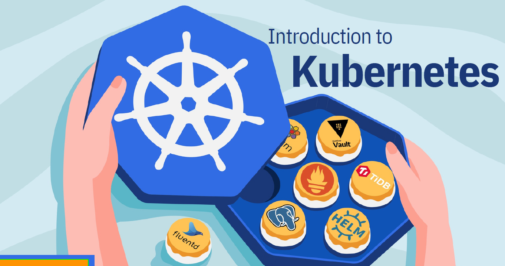

# Kubernetes learnings

    

## 1. DEFINITION

Kubernetes is an open source platform for managing containerized workloads and services. It provides a container runtime, container orchestration, container-centric
infrastructure orchestration, self-healing mechanisms, service discovery, load balancing
and container (de)scaling.
It is a platform designed to completely manage the life cycle of containerized
applications and services using methods that provide predictability, scalability, and
high availability.

- **Containers:**
Containers are lightweight, isolated environments that encapsulate an application and its dependencies. They provide a consistent and reproducible runtime environment, enabling applications to run reliably across different computing environments.

 - **Container Runtime:**
A container runtime is a software component responsible for running and managing containers on a host system. It is an essential part of the containerization technology stack and provides the necessary functionality to execute container images and manage their lifecycle. E.g Docker, Containerd.
- **Container orchestration:**
This refers to the management and coordination of containers within a distributed environment. It involves automating the deployment, scaling, scheduling, and management of containerized applications across a cluster of machines. E.g Kubernetes, Docker swarm, Apache Mesos.

## 2. WHAT PROBLEMS DOES K8s SOLVE
Containers are a good way to bundle and run your applications. In a production environment, you need to manage the containers that run the applications and ensure that there is no downtime. For example, if a container goes down, another container needs to start. Wouldn't it be easier if this behavior was handled by a system ?
That's how Kubernetes comes to the rescue! Kubernetes provides you with a framework to run distributed systems resiliently. It takes care of scaling and failover for your application, provides deployment patterns, and more. For example: Kubernetes can easily manage a canary deployment for your system.

Kubernetes provides you with:

- **Container Orchestration** 

Managing a large number of containers manually can be complex and time-consuming. Kubernetes automates the deployment, scaling, and management of containers, making it easier to run applications in a distributed environment.

- **Service Discovery and Load Balancing** 

In a dynamic container environment, services need a way to discover each other and communicate. Kubernetes provides service discovery mechanisms and built-in load balancing, ensuring that traffic is properly routed to containers.

- **Fault Tolerance and Self-Healing** 

Containers can fail for various reasons, such as hardware issues or software bugs. Kubernetes continuously monitors the health of containers and automatically restarts or replaces failed instances to maintain the desired state of the application.

- **Scalability and Resource Efficiency** 

Kubernetes enables horizontal scaling by allowing the dynamic creation and scaling of container replicas based on resource demands. This ensures optimal utilization of resources while handling increased traffic or workload.

## What next ?
3. [Kubernetes Architecture](docs/03-Achritecture.md)
4. [Kubernetes Manifests](docs/04-Manifest.md)
5. [Kubernetes Resources](docs/05-Resources.md)

