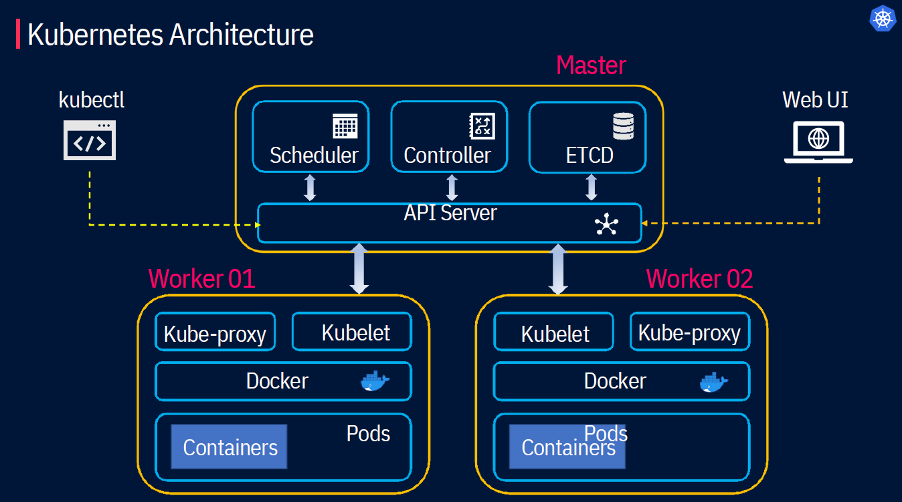
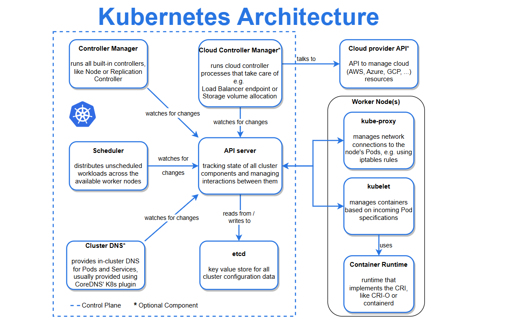

# Kubernetes architecture

    

## 1. Kubernetes Cluster
A Kubernetes cluster is a set of physical or virtual machines and other infrastructure resources called a node. There are two types of node in each Kubernetes cluster:
- **Master node(s):** hosts the Kubernetes control plane components and manages the cluster
- **Worker node(s):** runs your containerized applications

## 2. The Master Node

The master node is responsible for managing and controlling the cluster. It oversees the overall state of the cluster, schedules workloads, and coordinates communication between various components. The master node typically consists of the following components:

**API Server:** The API server acts as the primary control plane component, serving as the central management point for all cluster operations. It exposes the Kubernetes API, which allows users and other components to interact with the cluster.

**Scheduler:** The scheduler assigns pods to nodes based on resource requirements, availability, and other constraints. It determines the optimal placement of pods across the cluster to achieve efficient resource utilization.

**Controller Manager:** The controller manager runs various controllers responsible for managing different aspects of the cluster. Examples include the replication controller for maintaining desired pod replicas, the node controller for monitoring and managing nodes, and the service controller for managing services.

**etcd:** etcd is a distributed key-value store that serves as the cluster's primary datastore. It stores the persistent state of the cluster, including configuration data, API objects, and cluster health information.

## 3. Worker Nodes

Worker nodes are the compute nodes in the cluster where containers are deployed and run. Each worker node typically consists of the following components:

**Kubelet:** The kubelet is an agent running on each node and responsible for managing containers on that node. It communicates with the API server, receives pod specifications, and ensures that the containers are running and healthy.

**Container Runtime:** The container runtime, such as Docker or containerd, is responsible for pulling and running container images. It provides the underlying infrastructure for running containers on the node.

**Kube-proxy:** The kube-proxy enables network communication to and from the pods. It sets up network routing rules, load balances traffic, and provides service discovery capabilities within the cluster.

**Pods:** A pod is the basic scheduling unit in Kubernetes. It represents one or more co-located containers sharing the same network namespace and storage. Pods are created and scheduled onto worker nodes based on resource requirements and constraints defined in their specifications.

## 4. Summary

    

## Resources
- https://shipit.dev/posts/kubernetes-overview-diagrams.html 
- https://mohan08p.medium.com/simplified-kubernetes-architecture-3febe12480eb

