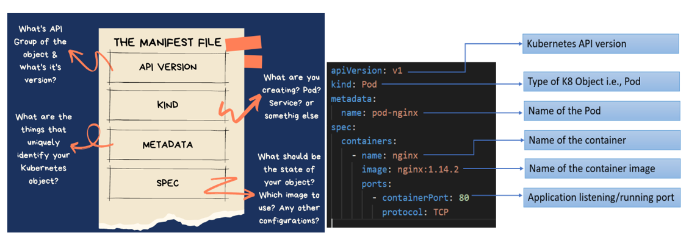

# Kubernetes Manifest File
<p align="center">
    
</p>


<div style="text-align: justify">
Kubernetes manifest files, which can be in YAML or JSON format, are used to describe objects in your Kubernetes cluster. They are the main tool for managing these objects. This is because they allow you to keep track of configuration changes along with your code and then apply these configurations to your cluster in a planned way.

Consider the following simple manifest file. It describes a Pod named nginx which runs a container using the nginx:latest image:

```bash
apiVersion: apps/v1
kind: Pod
metadata:
  name: nginx
spec:
  containers:
    - name: nginx
      image: nginx:latest
```

This manifest makes it clear that your cluster has a Pod called nginx with a container that runs the *nginx:latest image*.

You can easily create this Pod in any Kubernetes cluster using Kubectl and its manifest file. This avoids the need to remember the detailed syntax of direct commands like *kubectl run*.

**Using imperative command:**

Involves using any of the verb-based commands like **kubectl run, kubectl create, kubectl expose, kubectl delete, kubectl scale and kubectl edit**. Suitable for testing and interactive experimentation.

```bash
kubectl run nginx --image nginx:latest
```

**Using the manifest:**

Objects are written in YAML files and deployed using **kubectl create or kubectl apply**. Best suited for production environments.

```bash
kubectl apply -f pod.yaml
```

This example shows two ways to set up configurations in Kubernetes. With the imperative way, you give specific commands to tell Kubernetes how to create the Pod. But with declarative manifest…

## Resources
- https://spacelift.io/blog/kubernetes-manifest-file
- https://monokle.io/learn/kubernetes-manifest-files-explained
- https://medium.com/@a-dem/everything-about-kubernetes-manifest-files-b3c449fceefe

## What next ?

Previous [Architecture](./03-Achritecture.md)

Next [Namespaces-Labels-Selectors-Annotations](./05-Namespaces-Labels-Selectors-Annotations.md)

</div>