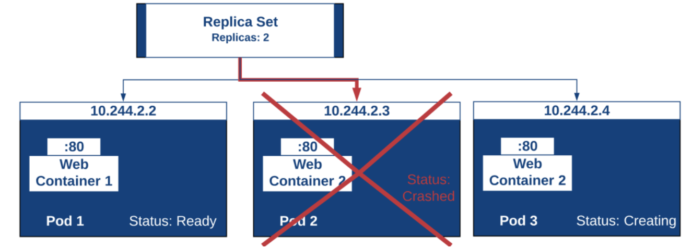
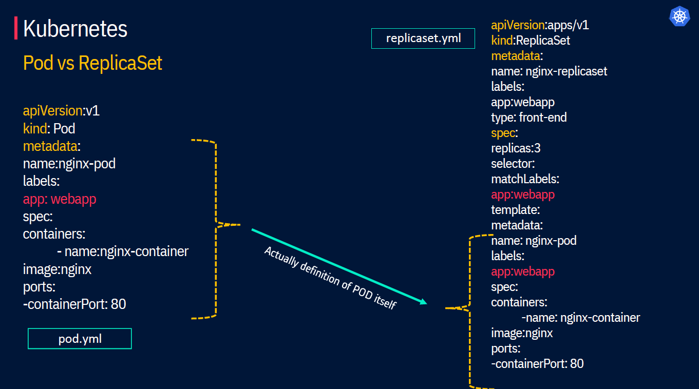
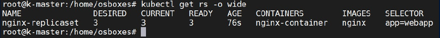
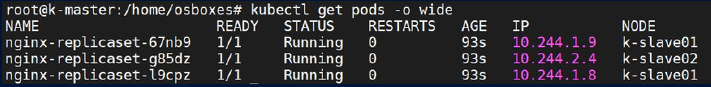

# Kubernetes Resources - Replicaset
<p align="center">
    
</p>

<div style="text-align: justify">

ReplicaSets are a higher-level API that gives the ability to easily run multiple instances of a given pod. ReplicaSets ensures that the exact number of pods(replicas) are always running in the cluster by replacing any failed pods with new ones.

The replica count is controlled by the replicasfield in the resource definition file. **Replicaset** uses `set-based` selectors whereas **replicacontroller** uses `equality based` selectors.

## Replicaset structure
<p align="center">
    
</p>

- ReplicaSet includes the pod definition template, a selector to match the pods, and a number of replicas.
- ReplicaSet then fulfills its purpose by creating and deleting Pods as needed to reach the desired replica number using the Pod template.
- It is recommended to use Deployments instead of directly using ReplicaSets, as they help manage ReplicaSets and provide declarative updates to Pods.

## Replicaset Creation
The manifest below (`replicaset.yml`) will deploy nginx just like we did with the pods, except this time we’ll use a ReplicaSet and specify that we should always have 2 replicas running in our cluster.

```bash
apiVersion: apps/v1 #version of the API to use
kind: ReplicaSet #What kind of object we're deploying
metadata: #information about our object we're deploying
  name: nginx-replicaset
spec: #specifications for our object
  replicas: 3 #The number of pods that should always be running
  selector: #which pods the replica set should be responsible for
    matchLabels:
      app: nginx #any pods with labels matching this I'm responsible for.
  template: #The pod template that gets deployed
    metadata:
      labels: #A tag on the pods created
        app: nginx
    spec:
      containers:
      - name: nginx-container #the name of the container within the pod
        image: nginx #which container image should be pulled
        ports:
        - containerPort: 80 #the port of the container within the pod
```


Let’s deploy the Replica Sets from the manifest file by running a kubectl command and then afterwards we’ll run a command to list our pods.

```bash
kubectl create –f replicaset.yml 
```

Or

```bash
kubectl apply –f replicaset.yml 
```

## Manipulating the replicasets
### List of replicasets

```bash
kubectl get rs –o wide # Get the list of replicasets in the cluster
```
<p align="center">
    
</p>

Now we can have the list of Pods created.
```bash
kubectl get pods –o wide # Get the list of replicasets in the cluster
```
<p align="center">
    
</p>

As you can see from the screenshot, we now have 3 pods running as we were expecting. Note: if you run the command too quickly, the pods might still be in a creating state. If this happens wait a second and run the get pod command again.

## Delete Replicaset

```bash
kubectl delete -f replicaset.yml 
```

## What Next ?
Previous [Replicaset](05-Recources-02.md)

Next [Deployment](05-Recources-03.md)
</div>