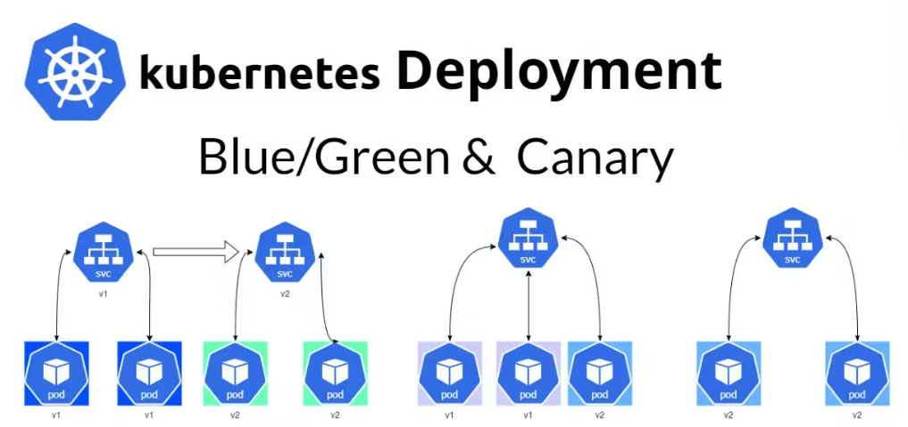
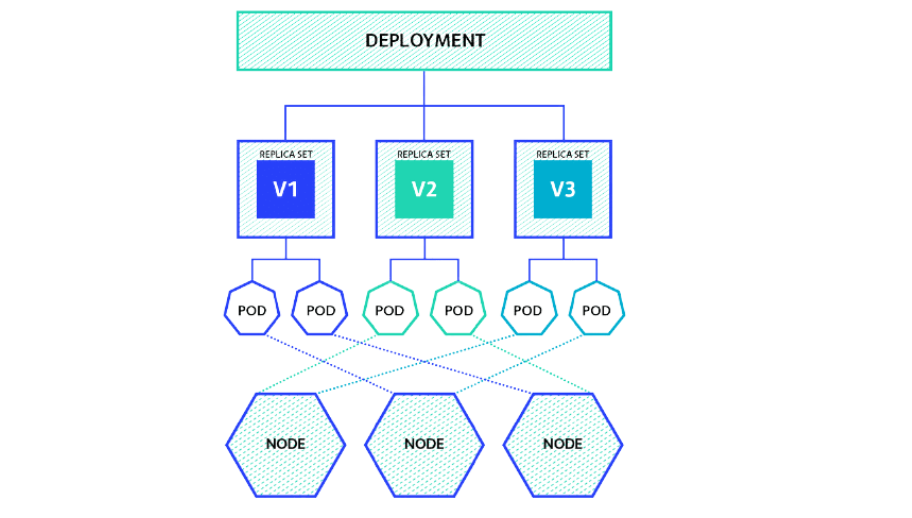
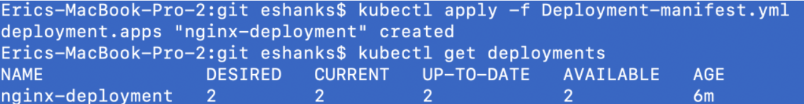
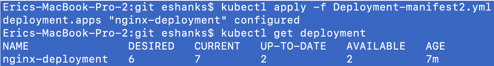
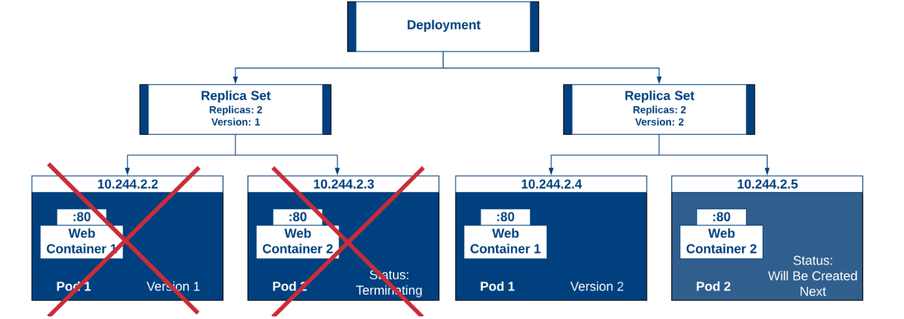

# Kubernetes Resources - Deployments
<p align="center">
    
</p>

<div style="text-align: justify">

A Kubernetes Deployment is a powerful tool in container orchestration. It allows you to manage the lifecycle of containerized applications, ensuring that a specified number of replicas of your application are running at any given time. Deployments automate the process of updating, scaling, and rolling back your applications, making the management of containers more efficient and reliable.

## How Kubernetes Deployment Works
Kubernetes Deployment operates through a series of steps:

1. **Deployment Creation:** You define a desired state in a Deployment configuration. This includes details like the number of replicas, container images, and resources needed.
2. **Deployment Controller:** Once the configuration is submitted, the Deployment Controller takes over. It checks the current state of the cluster and works to match the desired state.
3. **Updating Applications:** When you update a Deployment, such as changing the container image, Kubernetes gradually updates the Pods to the new version while ensuring service availability.
4. **Rollback and Scaling:** You can scale the number of replicas up or down. In case of issues, Kubernetes allows for easy rollback to a previous state.

## Deployment Strategies in Kubernetes
<p align="center">
    
</p>

**1. Rolling Update**

**Description:** Gradually replace the old version of the pod with the new version without downtime.

**Usage:** Ideal for non-critical updates where minor issues in new versions are acceptable.

**2. Blue-Green Deployment**

**Description:** Two identical environments are maintained; one (Blue) is the current production, and the other (Green) is the new version.

**Usage:** Suited for critical applications requiring extensive testing in a production-like environment before going live. Expensive because of redundant infrastructure. 

**3. Canary Releases**

**Description:** Releases the new version to a small subset of users before rolling it out to the entire user base.

**Usage:** Best for user-centric applications where feedback and user experience are critical for the update.

## Deployment In action
We’ll start with creating a manifest file (`Deployment-manifest.yml`) of our desired state configuration. Kubernetes will ensure that this desired state is applied and any items that need to be orchestrated will be handled to meet this configuration.


```bash
apiVersion: apps/v1 #version of the API to use
kind: Deployment #What kind of object we're deploying
metadata: #information about our object we're deploying
  name: nginx-deployment #Name of the deployment
  labels: #A tag on the deployments created
    app: nginx
spec: #specifications for our object
  replicas: 2 #The number of pods that should always be running
  selector: #which pods the replica set should be responsible for
    matchLabels:
      app: nginx #any pods with labels matching this I'm responsible for.
  template: #The pod template that gets deployed
    metadata:
      labels: #A tag on the replica sets created
        app: nginx
    spec:
      containers:
      - name: nginx-container #the name of the container within the pod
        image: nginx #which container image should be pulled
        ports:
        - containerPort: 80 #the port of the container within the pod
```


Now we’ll deploy this configuration to our kubernetes cluster by running:

```bash
kubectl create –f Deployment-manifest.yml # Create deployment based on the manifest
```

Or

```bash
kubectl apply –f Deployment-manifest.yml # Create/update deployment based on the manifest
```

## Manipulating the Deployments
### List of Deployments
Once the deployment has been applied to our cluster, we’ll run:
```bash
kubectl get get deployments –o wide # Get the list of deployments in the cluster
```
The results of our deployment should look similar to the following screenshot.
<p align="center">
    
</p>


There are several columns listed here but the gist of it is:

- **DESIRED**: 2 replicas of the application were in our configuration.
- **CURRENT**: 2 replicas are currently running.
- **UP-TO-DATE**: 2 replicas that have been updated to get to the configuration we specified.
- **AVAILABLE**: 2 replicas are available for use

This information may not seem to interesting at the moment, but remember that Deployments can take an existing set and perform a rolling update on them. When this occurs the information shown here may be more important.

### Describe deployment
```bash
kubectl describe deployment <deployment-name> –o wide # Get the description of the deployment called <deployment-name>
```
```bash
kubectl describe deployment nginx-deployment –o wide # Get the description of the deployment called nginx-deployment
```

### Rollout deployment
Let’s try to update our deployment and see what happens. Let’s modify our deployment manifest file to increase the number of replicas and also change the version of nginx that is being deployed. The file below makes those changes for you.

```bash
apiVersion: apps/v1 #version of the API to use
kind: Deployment #What kind of object we're deploying
metadata: #information about our object we're deploying
  name: nginx-deployment #Name of the deployment
  labels: #A tag on the deployments created
    app: nginx
spec: #specifications for our object
  strategy:
    type: RollingUpdate
    rollingUpdate: #Update Pods a certain number at a time
      maxUnavailable: 1 #Total number of pods that can be unavailable at once
      maxSurge: 1 #Maximum number of pods that can be deployed above desired state
  replicas: 6 #The number of pods that should always be running
  selector: #which pods the replica set should be responsible for
    matchLabels:
      app: nginx #any pods with labels matching this I'm responsible for.
  template: #The pod template that gets deployed
    metadata:
      labels: #A tag on the replica sets created
        app: nginx
    spec:
      containers:
      - name: nginx-container #the name of the container within the pod
        image: nginx:1.7.9 #which container image should be pulled
        ports:
        - containerPort: 80 #the port of the container within the pod
```
We can apply the configuration file again and then check our Deployment status using some familiar commands:
```bash
kubectl apply -f Deployment-manifest.yml # Apply deployment based on the manifest
```
```bash
kubectl get deployments # Get the list of deployments in the cluster
```
Now we see some more interesting information. Depending on how fast you were with your commands, you might get different results so use the screenshot below for this discussion.

<p align="center">
    
</p>

Since I ran the get deployments command before the whole thing was finished, my desired state doesn’t match the current state. In fact, the current state has MORE replicas than are desired. The reason for this is that the new pods are deployed first and then the old pods are removed.

In the example below, you can see that we’re going to remove the version 1 containers while we spin up version 2. To do this we spin up one pod with the new version and then start terminating the old pods. When this is done, the next pod will be created in version 2 and eventually the last pod in version 1 will be removed.

<p align="center">
    
</p>

The number of pods being deployed above desired state is configured in our manifest in the maxSurge specification. We could have made this number 2 and then two pods would be created at a time and two removed.

Now, sometimes you have a bigger update than the one we used for a demonstration. In that case you might not want to keep running the get deployments command. You can run:

```bash
kubectl rollout status deployment nginx-deployment # Give the status of the revisions
```
This command will show you a running list of whats happening with the rollout. I ran this during the deploy and here is an example of what you might see.

**Some Rollout commands**
```bash
kubectl rollout undo deployment <deployment -name> # Back to the previous revision of the deployment
```
```bash
kubectl rollout undo deployment <deployment -name> --to-revision=1 # Back to the revision 1 of the deployment
```
```bash
kubectl rollout pause deployment <deployment -name> # Put on hold the deployment called <deployment -name>
```
```bash
kubectl rollout resume deployment <deployment -name> # Resume the deployment called <deployment -name>
```

## Delete Replicaset

```bash
kubectl delete -f Deployment-manifest.yml # Deletes deployment and related dependencies
```

```bash
kubectl delete all --all # Deletes pods, replicasets, deployments and services in current namespace
```

## Sources
- https://theithollow.com/2019/01/30/kubernetes-deployments/
- https://k21academy.com/docker-kubernetes/kubernetes-deployment/
- https://www.qovery.com/blog/what-is-kubernetes-deployment-guide-how-to-use/
- https://apiko.com/blog/kubernetes-deployment-vs-service/


## What Next ?
Previous [Replicaset](05-Recources-02.md)

Next [Services](05-Recources-04.md)

</div>