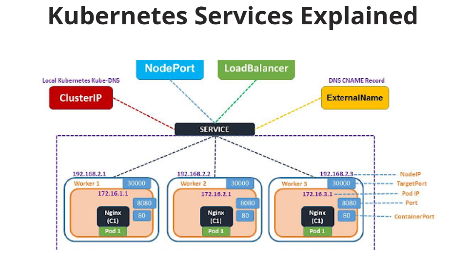
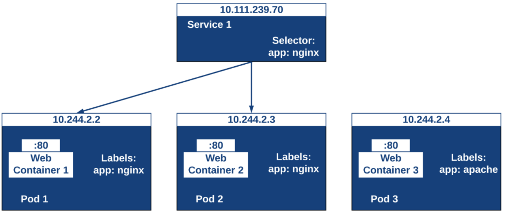
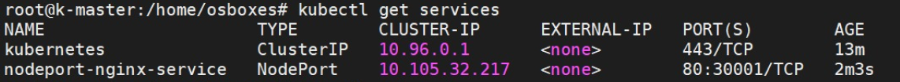

# Kubernetes Resources - Services
<p align="center">
    
</p>

<div style="text-align: justify">

In Kubernetes, services are generally a group of pods on the cluster, it is a logical, abstract layer, and here all of the pods perform the same function. This function is assigned a unique IP name and address. So that means if the service is running, that means the IP address will not change till then; also, in order to access the service, we have to follow its policies. 

Let take a few points to understand the service in detail;

1) Kubernetes service provides us with the route between the pods and also the discovery.

2) Helps us to connect a set of pods.

3) Kubernetes service helps us to connect our application frontend to its backend.

4) Services use selectors and labels, which helps us match the pods with the other application.

5) It consists of various types of an attribute; some of them are mentioned below;

- Port definition
- Label which helps us to connect to the pods
- Port number and assigned cluster IP address.
- Mapping of incoming ports to the out coming ports.

## How do Kubernetes Services work ?
In this section, we will see about the internal working on the Kubernetes service step by step so let’s get started,

1) First, it starts pointing to pods with the help of labels.

2) Also, the Kubernetes service is node-specific; it can still point to the pods, irrespective of where it is currently running in the cluster.

3) We can reach to the application with the help of the Services IP address or the DNS name if the service existed.

This will be clearer once we see the definition and creation of service in the next section of the tutorial.

## Kubernetes Service Types
In Kubernetes, we have different types of service:  
- **ExternalName**: This service type helps us map the service to a predefined externalName filed.
- **ClusterIp**: This type of service helps us to expose a service that can only be accessible with in the cluster.
- **LoadBalacer**: this type of service helps us to expose the service with the help of a cloud provider.
- **NodePort**: This type of service helps us to expose the service with the help of a static port present on each node IP.

### Kubernetes ClusterIP service 
This is the default service provided by Kubernetes; it mainly uses the IP address to expose the service. But it has one restriction here: it helps us expose the service with the help of an IP address, but it will be internal to the cluster. That means we can access the exposed service within the same cluster itself, not from outside that cluster. This can be sued when we do not want other external services to use our expose service, hence increasing the accessibility part here. In sort, we can say that it helps to expose the service on internal cluster IP if we choose this service, then we will only access the service with the cluster.

### Kubernetes NodePort service
As this name suggests, this service type helps expose the service on every node port. That means it allows us to open ports on every cluster node. So it will navigate the traffic to every node of the service, even if the service is not running on running on that particular node, thus helping us to handle the traffic as well by navigating it to a different node. It is one of the high-level methods which can be used in development. If we want to connect to the NodePort from outside of any cluster, then we can use this format to connect to them.

`<NodeIP>:<NodePort>`

### Kubernetes ExternalName service
As the name suggests here, this type of service can be accessed by the external name assigned to them. Rather than access them via cluster IP etc. In short, if we want to access this service, then we have to use the externalName field, which we define when creating the service. It returns a CNAME record that contains the value of the externalName parameter. In this type of service, no proxy is set up.

### Kubernetes Load Balancer service
This type of service helps us to expose the service to the cloud provider. Suppose we have a cluster that is running on any of the public clouds, for example, AZURE, AWS, so by creating a load balancer service, it will help us equivalent access like a cluster IP, by expanding this to an external load balancer that will turn specifically to the cloud provider. So Kubernetes will automatically create the environment with all required things like firewall; it will also help us populate the service with an external IP address provided by the cloud provider, create the load balancer, etc.

## Kubernetes Services - The Theory
Take a look at the example diagram below. Here we have a single Service that is front-ending two of our pods. The two pods have labels named “app: nginx” and the Service has a label selector that is looking for those same labels. This means that even though the pods might change addresses, as long as they are labeled correctly, the service, which stays with a constant address, will send traffic to them.
<p align="center">
    
</p>

You might also notice that there is a Pod3 that has a different label. The Service 1 service won’t front end that pod so we’d need another service that would take care of that for us. Now we’ll use a service to access our nginx pod later in this post, but remember that many apps are multiple tiers. Web talks to app which talks to database. In that scenario all three of those tiers may need a consistent service for the others to communicate properly all while pods are spinning up and down.

The way in which services are able to send traffic to the backend pods is through the use of the kube-proxy. Every node of our Kubernetes cluster runs a proxy called the kube-proxy. This proxy listens to the master node API for services as well as endpoints (covered in a later post). Whenever it finds a new service, the kube-proxy opens a random port on the node in which it belongs. This port proxies connections to the backend pods.

## Kubernetes Services and Labels – In Action
Let’s get to deploying our deployment manifest like we built in a previous post and then a Service to front-end that deployment. When we’re done, we’ll pull it open in a web browser to see an amazing webpage.

Let’s start off by creating a new manifest file (`nodeport-service.yml`) and deploying it to our Kubernetes cluster. The file is below and has two objects, Deployment & Service within the same file.

```bash
apiVersion: apps/v1 #version of the API to use
kind: Deployment #What kind of object we're deploying
metadata: #information about our object we're deploying
  name: nginx-deployment #Name of the deployment
  labels: #A tag on the deployments created
    app: nginx
spec: #specifications for our object
  replicas: 2 #The number of pods that should always be running
  selector: #which pods the replica set should be responsible for
    matchLabels:
      app: nginx #any pods with labels matching this I'm responsible for.
  template: #The pod template that gets deployed
    metadata:
      labels: #A tag on the replica sets created
        app: nginx
    spec:
      containers:
      - name: nginx-container #the name of the container within the pod
        image: nginx #which container image should be pulled
        ports:
        - containerPort: 80 #the port of the container within the pod 

---

apiVersion: v1 #version of the API to use
kind: Service #What kind of object we're deploying
metadata: #information about our object we're deploying
  name: nodeport-nginx-service #Name of the service
spec: #specifications for our object
  type: NodePort #Ignore for now discussed in a future post
  ports: #Ignore for now discussed in a future post
  - name: http
    port: 80 # Service Port
    targetPort: 80 # Container Port
    nodePort: 30001 # Node Port
    protocol: TCP # Protocol Type
  selector: #Label selector used to identify pods
    app: nginx
```

We can deploy this by running a command we should be getting very familiar with at this point.

```bash
kubectl apply -f nodeport-service.yml # Create/Update sercice
```
After the the manifest has been deployed we can look at the pods, replica sets or deployments like we have before and now we can also look at our services by running:

```bash
kubectl get services # Get the list of sercices in the cluster
``` 
<p align="center">
    
</p>


We can the details of the service by typing the command:
```bash
kubectl describe service nodeport-nginx-service # Provide the full information on the service
```


## Delete Services

```bash
kubectl delete -f nodeport-service.yml # Deletes service and related dependencies
```

```bash
kubectl delete all --all # Deletes pods, replicasets, deployments and services in current namespace
```

## Sources
- https://theithollow.com/2019/01/31/kubernetes-services-and-labels/
- https://www.educba.com/kubernetes-service/
- https://www.zippyops.com/kubernetes-services-explained


## What Next ?
Previous [Deployment](05-Recources-03.md)

Next [ConfigMaps](05-Recources-05.md)

</div>