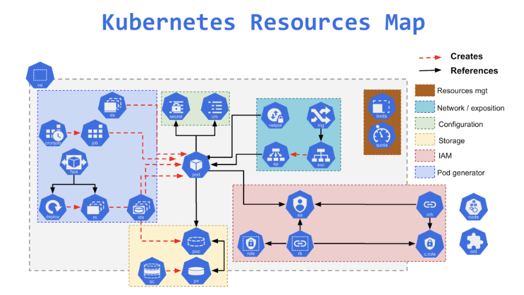
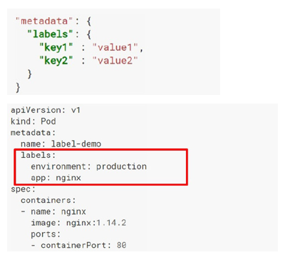
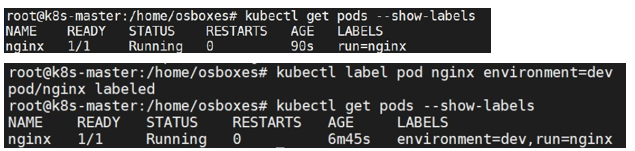
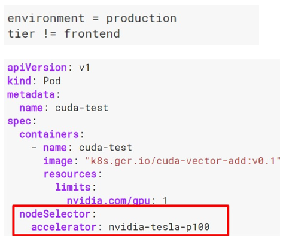

# Kubernetes Resources
<p align="center">
    
</p>


<div style="text-align: justify">

## 1. Namespaces
Namespaces provide a mechanism for isolating groups of resources within a single cluster.
- Namespace-based scoping is applicable only for namespaced objects (e.g. Deployments, Services, etc) and not for cluster-wide objects (e.g. StorageClass, Nodes, PersistentVolumes, etc).
- Names of resources need to be unique within a namespace, but not across namespaces.

Kubernetes starts with four initial namespaces:
- **default:** default namespace for objects with no other namespace.
- **kube-system:** namespace for objects created by the Kubernetes system.
- **kube-public:** namespace is created automatically and is readable by all users (including those not authenticated).
- **kube-node-lease:** namespace holds Lease objects associated with each node. Node leases allow the kubelet to send heartbeats so that the control plane can detect node failure.

Resource Quotas can be defined for each namespace to limit the resources consumed. Resources within the namespaces can refer to each other with their service names.

Resources across namespace can be reached using the full DNS <<service_name>>.<<namespace_name>>.svc.cluster.local.

**a. Get namespaces**
```bash
kubectl get namespaces
```

**b. Lists available objects under a specific namespace**
```bash
kubectl get all -n kube-system
```

**c. Lists available objects under all available namespaces**
```bash
kubectl get all --all-namespaces 
```

**d. Create a namespace**
```bash
kubectl create ns dev # Namespace for Developer team
```
```bash
kubectl create ns qa # Namespace for QA team
```
```bash
kubectl create ns production # Namespace for Production team
```

**e. Deploy objects in a namespace**
```bash
kubectl run nginx --image=nginx -n dev # Deploy nginx in the namespace dev
```
```bash
kubectl get pod/nginx –n dev # Get the list of the pods in the namespace dev
```
```bash
kubectl apply --namespace=qa -f pod.yaml # Using declarative method
```

**f. Delete a namespace**
```bash
kubectl delete ns production # Delete the namespace production
```

## 2. Labels, Annotations and Selectors
Labels and Annotations attach metadata to objects in Kubernetes.

**a. Labels**
- are key/value pairs that can be attached to Kubernetes objects such as Pods and ReplicaSets.
- can be arbitrary and are useful for attaching identifying information to Kubernetes objects.
- provide the foundation for grouping objects and can be used to organize and to select subsets of objects.
- are used in conjunction with selectors to identify groups of related resources.
- You can label pods, services, deployments and even nodes

**Declarative method**

<p align="center">
    
</p>

```bash
kubectl get pods -l environment=production # Get the list of the pods with the key/value environment=production
```
```bash
kubectl get pods -l environment=production, tier=frontend # Get the list of the pods with the key/value environment=production and tier=frontend
```
**Imperative method**

If labels are not mentioned while deploying k8s objects using imperative commands, the label is auto set as app: <object-name>
```bash
kubectl run --image nginx nginx # No Label assigned
```
```bash
kubectl label pod nginx environment=dev # Assigning a label to the pod nginx with key/value environment=dev
```
```bash
kubectl get pods --show-labels # Get the list of pods with their labels
```
<p align="center">
    
</p>

**b. Annotations**
- provide a storage mechanism that resembles labels
- are key/value pairs designed to hold non-identifying information that can be leveraged by tools and libraries.

**c. Selectors**
- Selectors allows to filter the objects based on labels
- The API currently supports two types of selectors: equality-based and set-based
- A label selector can be made of multiple requirements which are comma-separated.

**Equality-based Selector**

Equality or inequality-based requirements allow filtering by label keys and values.Three kinds of operators are admitted `=,==,!=`.
<p align="center">
    
</p>

## What next ?

1. [Pods](./05-Recources-01.md)
2. [Replicaset](./05-Recources-02.md)
3. [Deployment](./05-Recources-03.md)
4. Services
5. ConfigMaps
6. Secrets
7. Nodes
8. Ingress
9. Volumes
10. DaemonSet
11. StatefulSet
12. Jobs & Cron Jobs
</div>