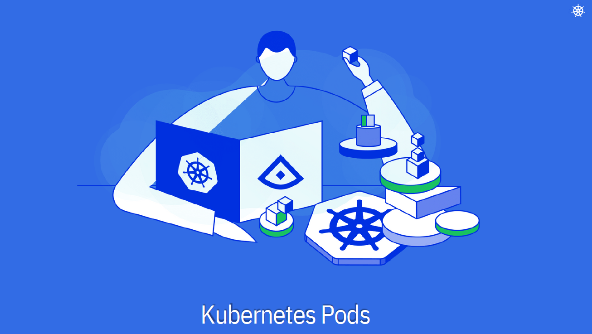
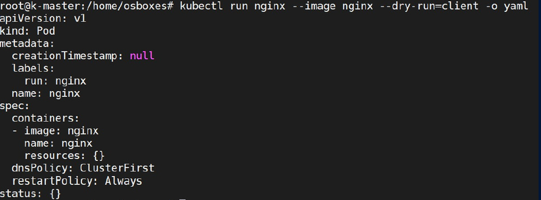
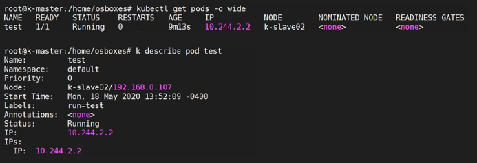

# Kubernetes Resources - Pods
<p align="center">
    
</p>

<div style="text-align: justify">

- A pod is the single instance of an application. A pod is defined as a YAML or JSON manifest that describes the desired state of the pod, including the container images, resource requirements, network settings, environment variables, and other configuration details.

- You can have a single container per pod  as well as run multiple containers within a pod. All containers within the pod get scaled together, you cannot scale individual containers within the pods. Recommended way is to have only one container per pod. Multi container pods are very rare. 

- Pods have dynamic IPs. Implying new IP every time it gets recreated.

- Pods have their lifecycle managed by the Kubernetes control plane. They can be created, scheduled to nodes, started, stopped, and restarted based on the desired state defined in the pod specification. 

- Pods are not self-healing; if a pod fails, it is terminated and a new one is created to replace it.

- In K8s, **initcontainer** is sometimes used as a second container inside pod. initcontainers are exactly like regular containers, except that they always run to completion. Each init container must complete successfully before the next one starts. If a Pod’s init container fails, Kubernetes repeatedly restarts the Pod until the init container succeeds

## Creating Pods
### Imperative way

```bash
kubectl run <pod-name> --image <image-name> # Create a pod called <pod-name> based on the image <image-name>
```
```bash
kubectl run nginx --image nginx --dry-run=client # Create a pod called nginx with the image nginx in dry-run 
```
***dry-run doesn't run the command but will show what the changes the command will to do in the cluster.***

```bash
kubectl run nginx --image nginx --dry-run=client –o yaml # Show the command ouput in YAML
```
<p align="center">
    
</p>

```bash
kubectl run test --image nginx --port 80 # Also exposes port 80 of container
```

### Declarative way

- Create a YAML file called `pod-definition.yml`

```bash
apiVersion: apps/v1
kind: Pod
metadata:
  name: nginx
  labels:
    app: webapp
spec:
  containers:
    - name: nginx
      image: nginx:latest
      ports:
      - containerPort: 80

```

- Run the command to create the Pod based on the manifest
```bash
kubectl create –f pod-definition.yml # Create a Pod
```
Or
```bash
kubectl apply –f pod-definition.yml # if manifest file is changed/updated after deployment and need to re-deploy the pod again
```

## Manipulating of Pods

### List of the Pod
```bash
kubectl get pods # Get the list of Pods
```
```bash
kubectl get pods -o wide # Get the list of Pods with all paramaters
```

### Describe the Pod
```bash
kubectl describe pod <pod-name> # Display extended information of pod called <pod-name>
```
```bash
kubectl describe pod test # Display extended information of pod called test
```
<p align="center">
    
</p>

### Get inside the Pod

```bash
kubectl exec -it nginx -- /bin/bash # Start a bash session inside the Pod called nginx
```

### Delete Pod

```bash
kubectl delete pod nginx # Delete Pod called nginx
```
## What Next ?
Previous [Namespaces-Labels-Selectors-Annotations](./05-Namespaces-Labels-Selectors-Annotations.md)

Next [Replicaset](./07-Replicaset.md)
</div>