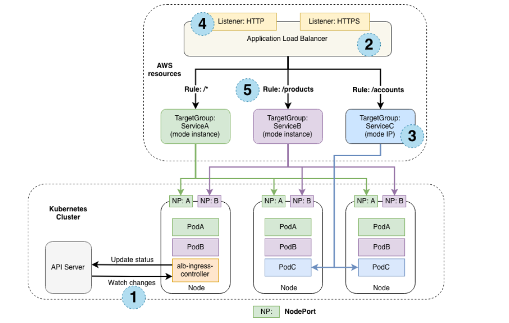
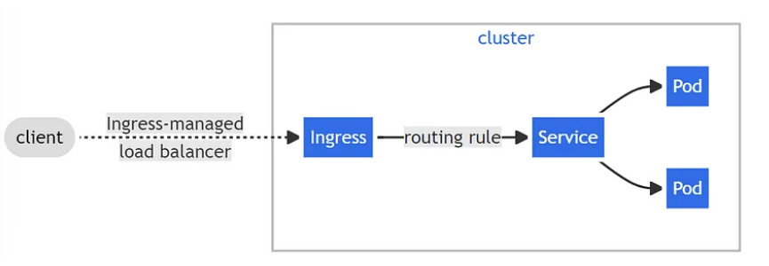

# Kubernetes Resources - Ingress
<p align="center">
    
</p>

<div style="text-align: justify">

Ingress is an API resource that provides a simple way of describing HTTP and HTTPS routes from outside the cluster to services within the cluster. The basic idea behind the Ingress is to provide a way of describing higher level traffic management constraints, specifically for HTTP. 

With Ingress, we can define rules for routing traffic without creating a bunch of Load Balancers or exposing each service on the node. It can be configured to give services externally-reachable URLs, load balance traffic, terminate SSL/TLS, and offer name-based virtual hosting and content-based routing. 

Using an ingress gives a Kubernetes administrator a single place to govern external access to multiple services running on the cluster. Ingress resources allows for a consistent set of routing rules, independent of the configuration of individual node services. This makes ingress vital for organizations scaling their use of Kubernetes.

## Ingress vs NodePort/LoadBalancer
To quickly recap, Kubernetes provides two ways to expose a service to external traffic:

1. **NodePort**: NodePort exposes a static port on all the nodes in the Kubernetes cluster. Any traffic request to the specified port is then forwarded to one or more nodes that may serve the pods related to the service.

2. **LoadBalancer**: An external load balancer (e.g., AWS Elastic Load Balancer, Google Cloud Load Balancer, Azure Load Balancer, MetalLB) is provisioned to load balance and route external requests to Kubernetes internal services.

<p align="center">
    
</p>

While both NodePort and LoadBalancer service types allow external traffic into the cluster, their functionalities are quite limited in scope.

Whenever you create a new service you must create a new NodePort or a LoadBalancer. In the case of LoadBalancer, this could incur more cost based on the supported load balancer provider. Also, there is no functionality to support networking logic such as domain-based routing or TLS termination.

Ingress, on the other hand, creates a single resource to consolidate services requiring exposure to external traffic as well as unifying routing logic:
- if we have two microservices servicing two different endpoints, ingress can route requests to one service versus another based on the domain, path, or HTTP header content.
- Ingress can also handle common network operations such as HTTPS redirection, TLS termination, or rate-limiting based on IP. Thus, ingress allows application developers to offload such complex logic to the Ingress and focus on core feature functionality on the services.


## Overview of ingress controllers
To use an Ingress, Kubernetes requires an `ingress controller` to handle ingress API requests.

Ingress controller is an application that runs in a cluster and configures an HTTP load balancer according to Ingress resources. The load balancer can be a software load balancer running in the cluster or a hardware or cloud load balancer running externally. Different load balancers require different Ingress controller implementations.

In order to Ingress resource work, the cluster must have an ingress controller running. You can deploy any number of ingress controllers within a cluster.

Some managed Kubernetes offerings come with an existing ingress controller (e.g., GCE Ingress Controller on Google Kubernetes Engine). However, for most self-hosted options, you need to first install and configure an ingress controller before using an Ingress.

## How Does an Ingress Controller Work ?
Since ingress-nginx is the ingress controller officially supported by the Kubernetes community, we will use that for this example. 

<p align="center">
    
</p>

1. The `nginx.conf` file inside the Nginx controller pod is a lua template that can talk to **Kubernetes ingress API** and get the latest values for traffic routing in real-time. [Here is the template file](https://github.com/kubernetes/ingress-nginx/blob/main/rootfs/etc/nginx/template/nginx.tmpl).
2. The Nginx controller talks to Kubernetes ingress API to check if there is any rule created for traffic routing.
3. If it finds any ingress rules, the Nginx controller generates a routing configuration inside `/etc/nginx/conf.d` location inside each nginx pod.
4. For each ingress resource you create, Nginx generates a configuration inside `/etc/nginx/conf.d` location.
5. The main `/etc/nginx/nginx.conf` file contains all the configurations from `/etc/nginx/conf.d`.
6. If you update the ingress object with new configurations, the Nginx config gets updated again and does a graceful reload of the configuration.

If you connect to the Nginx ingress controller pod using exec and check the `/etc/nginx/nginx.conf file`, you can see all the rules specified in the ingress object applied in the conf file.

## Ingress & Ingress Controller Architecture
Here is the architecture diagram that explains the ingress & ingress controller setup on a kubernetes cluster. It shows ingress rules routing traffic to two payment & auth applications

Now if you look at the architecture, it will make more sense and you will probably be able to understand how each ingress workflow works.

<p align="center">
    
</p>

## How to set up Nginx ingress
To follow this guide, you will need a Kubernetes cluster. Ingress-nginx documentation lists all the [supported Kubernetes distributions](https://kubernetes.github.io/ingress-nginx/deploy/#contents) if you want to follow along.

```bash
kubectl apply -f https://raw.githubusercontent.com/kubernetes/ingress-nginx/controller-
0.32.0/deploy/static/provider/baremetal/deploy.yaml
```

## Deployment of Nginx Controller

### Ingress Rules

<p align="center">
    
</p>

### Example 1: Single service ingress
An Ingress with no rules sends all traffic to a single default backend. If none of the hosts or paths match the HTTP request in the Ingress objects, the traffic is routed to the default backend.

```bash
apiVersion: extensions/v1beta1
kind: Ingress
metadata:
  name: echo-service
  namespace: default
spec:
  backend:
    serviceName: echo
    servicePort: 80
```

### Example 2: Host-Based Load Balancing
With host-based load balancing, users can access your service directly by reaching a specific domain name. For instance, they could access it at foo.bar.com or foo.bar.com/bar, depending on your configuration.

We can refer to the official Kubernetes documentation for detailed instructions. Here’s a simple example from the documentation that demonstrates how an Ingress routes all traffic to a single service.

<p align="center">
    
</p>

The Ingress controller acts as a managed load balancer for your Kubernetes cluster. You create Ingress resources that define how to route traffic based on various criteria (e.g., URLs, hostnames) to your backend services (applications or pods)

1. Make sure that Nginx Ingress Controller is deployed

2. Create the `ingress.yaml` file

```bash
apiVersion: networking.k8s.io/v1
kind: Ingress
metadata:
  name: ingress-example
spec:
  rules:
  - host: "foo.bar.com"
    http:
      paths:
      - pathType: Prefix
        path: "/bar"
        backend:
          service:
            name: python-fastapi-app-service
            port:
              number: 80
```

3. Deploy the Ingress resource

```bash
kubectl apply -f ingress.yml
```

4. test the connectivity

```bash
curl -L http://foo.bar.com/bar -v
```
<p align="center">
    
</p>

### Example 3: Simple fanout
A fanout configuration routes traffic based on the HTTP URI of the request. It allows us to use a single load balancer and IP address to serve multiple backend services.

<p align="center">
    
</p>

- Edit a manifest `simple-fanout.yml` for ingress rules

```bash
apiVersion: extensions/v1beta1
kind: Ingress
metadata:
  name: ingress-service
  namespace: default
spec:
  rules:
    - host: services.example.com
      http:
        paths:
          - backend:
              serviceName: service1
              servicePort: 80
            path: /service1
          - backend:
              serviceName: service2
              servicePort: 80
            path: /service2
```

- Create the ingress rules for the Simple fanout

```bash
kubectl apply -f simple-fanout.yml
```

### Example 4: Hostname based routing
Hostname-based routing supports having one load balancer to handle traffic for different hostnames pointing to the same IP address.

<p align="center">
    
</p>

- Edit a manifest `hostname-based.yml` for the Hostname based routing
ingress rules

```bash
apiVersion: extensions/v1beta1
kind: Ingress
metadata:
  name: public-services
  namespace: default
spec:
  rules:
    - host: service1.example.com
      http:
        paths:
          - backend:
              serviceName: service1
              servicePort: 80
            path: /
    - host: service2.example.com
      http:
        paths:
          - backend:
              serviceName: service2
              servicePort: 80
            path: /service2
```

- Create the ingress rules for the hostname based routing

```bash
kubectl apply -f hostname-based.yml
```

### Example 5: TLS
Ingress can also provide TLS support, but it is limited to port 443 only. If the TLS configuration section in an Ingress specifies different hosts, they are multiplexed on the same port according to the hostname that's been specified through the SNI TLS extension (if the Ingress controller supports SNI). The TLS secret must contain keys named tls.crt and tls.key, which contain the certificate and private key for TLS.

<p align="center">
    
</p>

- Create a secret with the manifest `secret.yml` 
```bash
apiVersion: v1
kind: Secret
metadata:
  name: public-services-tls
  namespace: default
data:
  tls.crt: base64 encoded cert
  tls.key: base64 encoded key
type: kubernetes.io/tls
```

- Create the resource object
```bash
kubectl apply -f secret.yml
```

Referencing this secret in an Ingress tells the Ingress controller to secure the channel from the client to the load balancer using TLS. We need to make sure the TLS secret we have created came from a certificate that contains a Common Name (CN), also known as a Fully Qualified Domain Name (FQDN) for `services.example.com`. 

- Edit the manifest `services-with-tls.yml` for the ingress rules

```bash
apiVersion: networking.k8s.io/v1beta1
kind: Ingress
metadata:
  name: services-with-tls
  namespace: default
spec:
  tls:
    - hosts:
        - services.example.com
      secretName: public-services-tls
  rules:
    http:
      paths:
        - backend:
            serviceName: service1
            servicePort: 80
          path: /service1
        - backend:
            serviceName: service2
            servicePort: 80
          path: /service2
```

- Create the ingress rules
```bash
kubectl apply -f services-with-tls.yml
```


## Sources
- https://www.loft.sh/blog/kubernetes-nginx-ingress
- https://outshift.cisco.com/blog/k8s-ingress
- https://www.spectrocloud.com/blog/getting-started-with-kubernetes-ingress
- https://devopscube.com/kubernetes-ingress-tutorial/
- https://devopscube.com/setup-ingress-kubernetes-nginx-controller/
- https://medium.com/devops-mojo/kubernetes-ingress-overview-what-is-kubernetes-ingress-introduction-to-k8s-ingress-b0f81525ffe2
- https://blog.devops.dev/kubernetes-ingress-how-to-use-an-ingress-controller-with-your-kubernetes-applications-359dffd465f8


## What Next ?
Previous [Services](./09-Services.md)

Next [Volumes](./11-Volumes.md)

</div>
