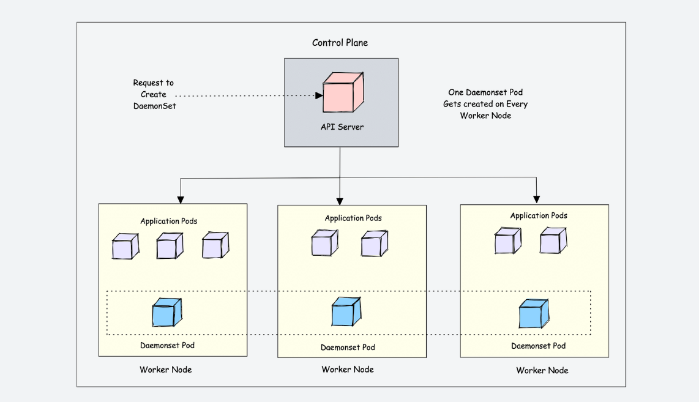
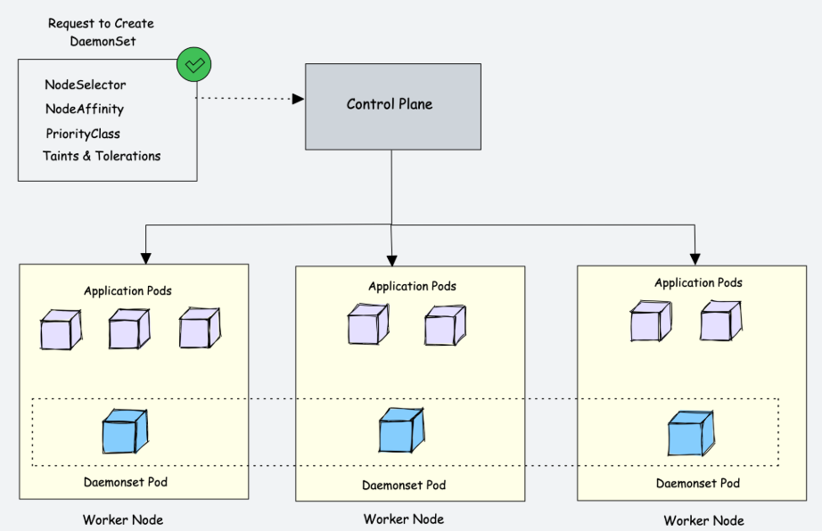
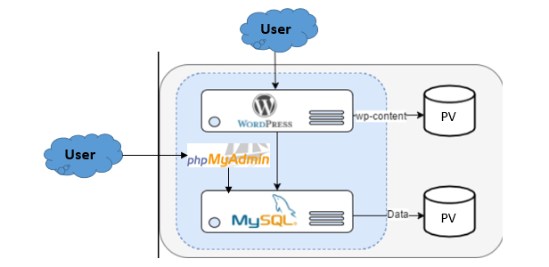

# Kubernetes Resources - Daemonset
<p align="center">
    
</p>

<div style="text-align: justify">

## What is a DaemonSet In Kubernetes?
Kubernetes is a distributed system and there should be some functionality for kubernetes platform administrators to run platform-specific applications on all the nodes. For example, running a logging agent on all the Kubernetes nodes.

Here is where Daemonset comes into the picture.

Daemonset is a native **Kubernetes object**. As the name suggests, it is designed to run system daemons.

The DaemonSet object is designed to ensure that **a single pod runs on each worker node**. This means you cannot scale daemonset pods in a node. And for some reason, if the daemonset pod gets deleted from the node, the daemonset controller creates it again.

Let’s look at an example. If there are 500 worker nodes and you deploy a daemonset, the daemonset controller will run one pod per worker node by default. That is a total of 500 pods. However, using **`nodeSelector`**, **`nodeAffinity`**, **`Taints`**, and **`Tolerations`**, you can restrict the daemonset to run on specific nodes.

For example, in a cluster of 100 worker nodes, one might have 20 worker nodes labeled GPU enabled to run batch workloads. And you should run a pod on those 20 worker nodes. In this case, you can deploy the pod as a Daemonset using a node selector. We will look at it practically later in this guide.

Another example is that you have a specific number of worker nodes dedicated to platform tools (ingress, monitoring, logging, etc.) and want to run Daemonset related to platform tools only on the nodes labeled as platform tools. In this case, you can use the **nodeSelector** to run the daemonset pods only on the worker nodes dedicated to platform tooling. 

<p align="center">
    
</p>

## Types of Kubernetes Volumes
There are different types of volumes you can use in a Kubernetes pod:

1. Node-local memory (emptyDir and hostPath)
2. Cloud volumes (e.g., awsElasticBlockStore, gcePersistentDisk, and azureDiskVolume)
3. File-sharing volumes, such as Network File System (nfs)
4. Distributed-file systems (e.g., cephfs, rbd, and glusterfs)
5. Special volume types such as PersistentVolumeClaim, secret, configmap and gitRepo

- Both `emptyDir` and `hostPath` are attached to the pod, stored either in RAM or in persistent storage on a drive. As they depend on the pod, their content is available as long as the pod is running. If it goes down, the data is lost.

- With `Cloud volumes`, `nfs`, and `PersistentVolumeClaim`, the volume is independent and placed outside of the pod. Although they are essentially all designed to preserve data, cloud volumes are significantly more difficult to handle. To connect the pod to the provider, the user must know many storage details.

- `Network File Systems` and `Persistent Volumes` are much more practical. In fact, these two volume types work on the same principles.

- `NFS` lets you connect to a volume through a yaml file. Without the pod, the content of the volume is unmounted but remains available. However, even for NFS setups you need to send a `Persistent Volume Claim (PVC)` request.

Hence, Persistent Volume Claims are the core solution for persistent volumes in Kubernetes.

## Persistent Volumes (PV) and Persistent Volume Claims (PVC)
A `Persistent Volume (PV)` in Kubernetes is a storage resource within the cluster provisioned by an administrator. It abstracts the underlying storage implementation, providing a consistent interface for applications. 

On the other hand, a `Persistent Volume Claim (PVC)` is a request for storage by a user or a pod. PVCs are used by applications to consume storage resources without needing to know the details of the underlying storage.

When a PVC is created, it references a specific PV, binding the two together. The PV is then bound to a particular node in the cluster. This process ensures that the storage is available to the requesting pod. This abstraction simplifies the management of storage resources in a Kubernetes environment.


## Features of Persistent Volumes
Each PV contains a specification (spec) and the volume's status. This section describes the spec attributes of a PV configuration file used for persistent volumes. 

**1. Capacity**

Generally, a PV will specify storage capacity. This is set by using the capacity property of the PV. Currently, the capacity property attribute storage is the only resource that can be set or requested. In the future, it may include attributes such as IOPS, throughput rate, etc..

**2. Volume Modes**

Kubernetes supports two volume modes of persistent volumes. 
- **`Filesystem`** 
- **`Block`** 

Filesystem is the default mode if the volume mode is not defined.

**3. Volume Access Modes**

- **ReadOnlyMany(ROX)** allows being mounted by multiple nodes in read-only mode.
- **ReadWriteOnce(RWO)** allows being mounted by a single node in read-write mode.
- **ReadWriteMany(RWX)** allows multiple nodes to be mounted in read-write mode.

A volume can only be mounted using one access mode at a time, even if it supports many access modes.

**4. Volume Class**

A PV can specify a **`StorageClass`** to dynamically bind the PV and PVC, where the specific StorageClass is specified via the **`storageClassName`** property. If no PV is specified with this property, it can only bind to a PVC that does not require a specific class.

**5. Reclaim Policy**

When the node no longer needs persistent storage, the reclaiming strategies that can be used include:

- **`Retain`**: The Retain reclaim policy allows for manual reclamation of the resource. When the PVC is deleted, the PV still exists, and the volume is considered "released." However, it is not yet available for another claim because the previous claimant's data remains on the volume.

- **`Delete`**: For storage volume plugins that support a Delete reclaim policy, deletion removes the PV from Kubernetes. Also, it removes the storage asset from the associated external infrastructure, such as AWS EBS, GCE PD, Azure Disk, or Cinder storage volumes.

- **`Recycle`**: Meaning the data can be restored later after getting scrubbed.

Currently, `only NFS and hostPath support the Recycle policy. AWS EBS, GCE PD, Azure Disk, and Cinder volumes support the Delete policy`.

**6. Mount Options**

Kubernetes administrators can specify mount options for mounting persistent volumes on a node. Not all PV types support mount options.

Common types of mount options supported are:
- gcePersistentDisk
- awsElasticBlockStore
- AzureDisk
- NFS
- RBD (Rados Block Device)
- CephFS
- Cinder (OpenStack volume storage)
- Glusterfs

## Lifecycle of PV and PVC
In a Kubernetes cluster, a PV exists as a storage resource in the cluster. PVCs are requests for those resources and also act as claim checks to the resource. The interaction between PVs and PVCs follows this lifecycle:

**1. Provisioning - static or dynamically using StorageClass** 

There are two ways to provision persistent storage volumes in Kubernetes:

- **Static**:
PVs are created by Kubernetes cluster administrators and exist in the Kubernetes API. PVs represent real storage, and these stores provided by PVs are available to all users in the cluster. With static provisioning, the PV is created in advance by the cluster administrator; the developer creates the PVC and the Pod, and the Pod uses the storage provided by the PV through the PVC.

- **Dynamic**:
For dynamic provisioning, when none of the static PVs created by the administrator can match the user’s PVC, the cluster will try to automatically provision a storage volume for the PVC, which is based on StorageClass. In the dynamic provisioning direction, the PVC needs to request a storage class, but this storage class must be pre-created and configured by the administrator. The cluster administrator needs to enable the access controller for DefaultStorageClass in the API Server.

**2. Binding - Assigning the PV to the PVC**

The user creates a PVC (or has previously created one for dynamic provisioning), specifying the requested storage size and access mode. The master has a control loop to monitor new PVCs, find matching PVs (if any), and bind the PVC and PV together. If a PV is ever dynamically provisioned to a new PVC, the loop will always bind that PV to the PVC. In addition, users will always get at least the storage they request, but the volume may exceed their request. Once bound, PVC bindings are exclusive, no matter what their binding mode is.

If no matching PV is found, the PVC will remain unbound indefinitely, and once the PV is available, then the PVC will become bound again. For example, if a cluster is provisioned with many 50G PVs, it will not match the 100G PVCs requested, and the PVCs will not be bound until 100G PVs are added to the cluster.


**3. Using - Pods use the volume through the PVC**

The Pod uses PVC as a volume, and the Kubernetes cluster looks up the bound PV by the PVC and mounts it to the Pod. The user can specify the access method when using PVC as a volume. For volumes that support multiple access methods, the user specifies which mode is desired when using their claim as a volume in a Pod. Once a user has a bound PVC, the bound PV belongs to that user. The user can access the possessed PV through the PVC contained in the Pod’s storage volume.

**4. Reclaiming - The PV is reclaimed**

The PV is reclaimed, either by keeping it for the next use or by deleting it directly from the cloud storage.

Finally, a volume will be in one of the following states:

- **`Available`** - this state shows that the PV is ready to be used by the PVC.
- **`Bound`** - this state shows that the PV has been assigned to a PVC.
- **`Released`** - the claim has been deleted, but the cluster has not yet reclaimed the resource.
- **`Failed`** - this state shows that an error has occurred in the PV.

## Kubernetes Volumes - Common Use Cases
### **EmptyDir**

An emptyDir volume is first created when a Pod is assigned to a Node, and exists as longas that Pod is running on that node. As the name says, it is initially empty. All containers in a Pod can read and write the same files in an emptyDir volume.
When a Pod is removed from a node for any reason, the data in the emptyDir is deletedforever. emptyDir is good for:
- Large temporary space.
- Sharing files between containers in a Pod.

```bash
apiVersion: v1
kind: Pod
metadata:
  name: test-pod
  labels:
    name: myapp
spec:
  containers:
  - name: test-container
    image: busybox
    ports:
      - containerPort: 80
    volumeMounts:
      - name:  testVolume
        mountPath: /test-pod # the location where the volume will be mounted inside the container a folder named test-pod will be created
  volumes:
  - name: testVolume
    emptyDir: {}
```

### **ConfigMap as a Volume**
A ConfigMap is a dictionary of key-value pairs that can be used to configure a container.A ConfigMap can be used to store configuration data that is not sensitive. A ConfigMap can be used to store configuration data that is shared between containersin a pod.

 - Create a YAML file called `nginx-config.yml`

```bash
apiVersion: v1
kind: ConfigMap
metadata:
  name: nginx-config
  labels:
    app: myapp
data:
  nginx.conf: |
    # Nginx configuration file
      server {
        listen 80;
        server_name localhost;
        location / {
          root /usr/share/nginx/html;
          index index.html;
        }
      }
```

- Create a manifest for a pod which is a YAML file called `nginx-pod.yml`

```bash
apiVersion: v1
kind: Pod
metadata:
  name: nginx-pod
  labels:
    name: myapp
spec:
  containers:
  - name: nginx-container
    image: nginx:latest
    ports:
      - containerPort: 80
    volumeMounts:
      - name:  nginx-config-volume
        mountPath:  /etc/nginx/nginx.conf
        subPath: nginx.conf
  volumes:
    - name:  nginx-config-volume
      configMap:
      name: nginx-config 
      items:
      - key: nginx.conf
        path: nginx-config
```
### **Secret as a Volume**

A Secret is a dictionary of key-value pairs that can be used to store sensitive data. A Secret can be used to store sensitive data that is shared between containers in a pod. The data in a Secret is stored in base64 encoded format and is not encrypted by default. To create a secret a secret make sure the data is base64 encoded. A secret value can be used as an environment variable or as a file in a volume.

- Create a YAML file called `db-secret.yml`

```bash
apiVersion: v1
kind: Secret
metadata:
  name:  db-secret
type: Opaque
data:
   username: YWRtaW4=
   password: cGFzc3dvcmQ=
```

- Create a manifest for a pod which is a YAML file called `secret-pod.yml`

```bash
apiVersion: v1
kind: Pod
metadata:
  name: secret-pod
spec:
  containers:
  - name: secret-container
    image: busybox
    ports:
      - containerPort: 80
    volumeMounts:
      - name: secret-volume
        mountPath: "/etc/db-secret"
        readOnly: true
  volumes:
    - name: secret-volume
      secret:
        secretName: db-secret
```

### PV and PVC - MySQL Deployment + Wordpress + PhpMyAdmin
The following config file describes a single-instance MySQL Deployment. The MySQL container mounts the PV at `/var/lib/mysql`. The `MYSQL_ROOT_PASSWORD` environment variable sets the database password from the Secret.

<p align="center">
    
</p>

1. Create a manifest for ConfigMap called `configmap.yml`

```bash
apiVersion: v1
kind: ConfigMap
metadata:
  name: mysql-cm
data:
  mysql-url: mysql-service
```

2. Create a manifest for secret called `secret.yml`

```bash
apiVersion: v1
kind: Secret
metadata:
  name:  mysql-secret
type: Opaque
data:
   mysql-user: cm9vdA==
   mysql-pass: cGFzc3dvcmQ=
   mysql-db: d29yZHByZXNz
```

3. Create a Persistent Volume and Persistent Volume Claim for MySQL with the manifest `mysql-pv-pvc.yml`

```bash
# MySQL PV
apiVersion: v1
kind: PersistentVolume
metadata:
  name: mysql-pv
spec:
  capacity:
    storage: 5Gi
  accessModes:
    - ReadWriteOnce
  hostPath:
    path: /data/mysql
---
# MySQL PVC
apiVersion: v1
kind: PersistentVolumeClaim
metadata:
  name: mysql-pvc
spec:
  accessModes: 
    - ReadWriteOnce
  resources:
    requests:
      storage: 5Gi
```

4. Create a Persistent Volume and Persistent Volume Claim for WordPress with the manifest `wordpress-pv-pvc.yml`

```bash
# Wordpress PV
apiVersion: v1
kind: PersistentVolume
metadata:
  name: wordpress-pv
spec:
  capacity:
    storage: 5Gi
  accessModes:
    - ReadWriteOnce
  hostPath:
    path: /data/wordpress
---
# Wordpress PVC
apiVersion: v1
kind: PersistentVolumeClaim
metadata:
  name: wordpress-pvc
spec:
  accessModes:
    - ReadWriteOnce
  resources:
    requests:
      storage: 5Gi
```


5. Create Mysql Deployment and service with the manifest `mysql.yml`

```bash
# MySQl Deployment
apiVersion: apps/v1
kind: Deployment
metadata:
  name: mysql-deployment
spec:
  replicas: 1
  selector:
    matchLabels:
      app: mysql
  strategy:
    type: Recreate
  template:
    metadata:
      labels:
        app: mysql
    spec:
      containers:
      - name: mysql-container
        image: mysql:5.6
        env:
          - name: MYSQL_ROOT_PASSWORD 
            valueFrom:
              secretKeyRef:
                name: mysql-secret
                key: mysql-pass
          - name: MYSQL_DATABASE 
            valueFrom:
              secretKeyRef:
                name: mysql-secret
                key: mysql-db 
        ports:
        - containerPort: 3306
        volumeMounts:
          - name:  mysql-persistent-storage
            mountPath:  /var/lib/mysql
        resources:
          requests:
            memory: "256Mi"
            cpu: "100m"
          limits:
            memory: "512Mi"
            cpu: "200m"
      volumes:
        - name:  mysql-persistent-storage
          persistentVolumeClaim:
            claimName: mysql-pvc
---
# MySQL Service
apiVersion: v1
kind: Service
metadata:
  name: mysql-service
  labels:
    app: mysql 
spec:
  selector:
    app: mysql
  ports:
  - port: 3306
    targetPort: 3306
```

6. Create PhpMyAdmin Deployment and service with the manifest `phpmyadmin.yml`

```bash
# PhpMyAdmin deployment
apiVersion: apps/v1
kind: Deployment
metadata:
  name: phpmyadmin
spec:
  replicas: 1
  selector:
    matchLabels:
      app: phpmyadmin
  template:
    metadata:
      labels:
        app: phpmyadmin
    spec:
      containers:
      - name: phpmyadmin
        image: phpmyadmin/phpmyadmin:latest
        env:
        - name: PMA_HOST
          valueFrom:
            configMapKeyRef:
              name: mysql-cm
              key: mysql-url
        - name: PMA_USER
          valueFrom:
            secretKeyRef:
              name: mysql-secret
              key: mysql-user
        - name: PMA_PASSWORD 
          valueFrom:
            secretKeyRef:
              name: mysql-secret
              key: mysql-pass
        ports:
        - containerPort: 80
        resources:
          requests:
            memory: "256Mi"
            cpu: "100m"
          limits:
            memory: "512Mi"
            cpu: "200m"
---
# PhpMyAdmin Service
apiVersion: v1
kind: Service
metadata:
  name: phpmyadmin-service
  labels:
    app: phpmyadmin 
spec:
  type: NodePort
  selector:
    app: phpmyadmin
  ports:
  - port: 80
    targetPort: 80
    nodePort: 30002
```

7. Create Wordpress Deployment with the manifest `wordpress.yml`

```bash
# Wordpress Deployment
apiVersion: apps/v1
kind: Deployment
metadata:
  name: wordpress-deployment
spec:
  replicas: 1
  selector:
    matchLabels:
      app: wordpress
  strategy:
    type: Recreate
  template:
    metadata:
      labels:
        app: wordpress
    spec:
      containers:
      - name: wordpress-container
        image: wordpress:latest
        env:
          - name: WORDPRESS_DB_USER 
            valueFrom:
              secretKeyRef:
                name: mysql-secret
                key: mysql-user
          - name: WORDPRESS_DB_PASSWORD 
            valueFrom:
              secretKeyRef:
                name: mysql-secret
                key: mysql-pass
          - name: WORDPRESS_DB_NAME 
            valueFrom:
              secretKeyRef:
                name: mysql-secret
                key: mysql-db
          - name: WORDPRESS_DB_HOST 
            valueFrom:
              configMapKeyRef:
                name: mysql-cm
                key: mysql-url
        ports:
        - containerPort: 80
        volumeMounts:
          - name:  wordpress-persistent-storage
            mountPath:  /var/www/html
        resources:
          requests:
            memory: "256Mi"
            cpu: "100m"
          limits:
            memory: "512Mi"
            cpu: "200m"
      volumes:
      - name:  wordpress-persistent-storage
        persistentVolumeClaim:
          claimName: wordpress-pvc 
---
# Wordpress Service
apiVersion: v1
kind: Service
metadata:
  name: wordpress-service
  labels:
    app: wordpress 
spec:
  type: NodePort
  selector:
    app: wordpress
  ports:
  - port: 80
    targetPort: 80
    nodePort: 30001
```


## Sources
- https://www.linkedin.com/pulse/day-36-managing-persistent-volumes-your-deployment-amit-sharma-m0jyf/
- https://phoenixnap.com/kb/kubernetes-persistent-volumes
- https://blog.mayadata.io/understanding-persistent-volumes-and-pvcs-in-kubernetes
- https://www.loft.sh/blog/kubernetes-persistent-volume


## What Next ?
Previous [Ingress](./10-Ingress.md)

Next [Daemonset](./11-Daemonset.md)

</div>