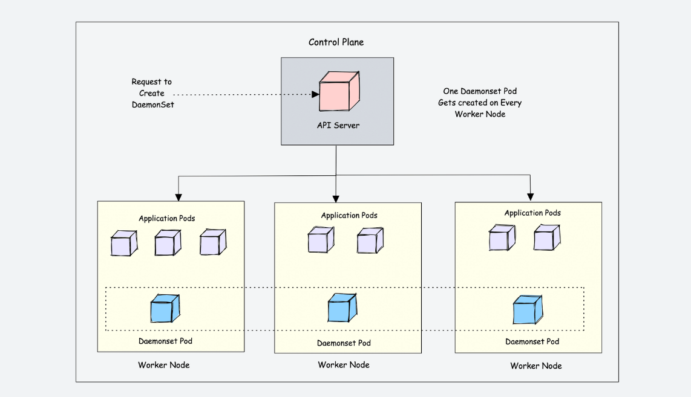
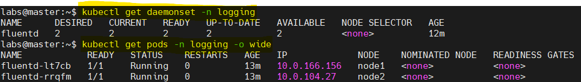
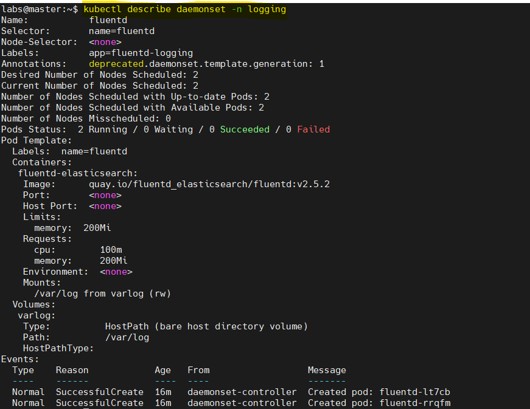
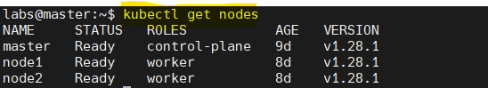
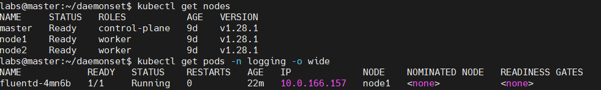
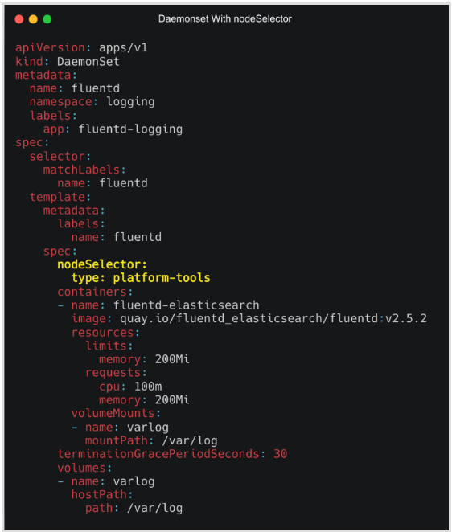

# Kubernetes Resources - Daemonset
<p align="center">
    
</p>

<div style="text-align: justify">

## What is a DaemonSet In Kubernetes?
Kubernetes is a distributed system and there should be some functionality for kubernetes platform administrators to run platform-specific applications on all the nodes. For example, running a logging agent on all the Kubernetes nodes.

Here is where Daemonset comes into the picture.

Daemonset is a native **Kubernetes object**. As the name suggests, it is designed to run system daemons.

The DaemonSet object is designed to ensure that **a single pod runs on each worker node**. This means you cannot scale daemonset pods in a node. And for some reason, if the daemonset pod gets deleted from the node, the daemonset controller creates it again.

Let’s look at an example. If there are 500 worker nodes and you deploy a daemonset, the daemonset controller will run one pod per worker node by default. That is a total of 500 pods. However, using **`nodeSelector`**, **`nodeAffinity`**, **`Taints`**, and **`Tolerations`**, you can restrict the daemonset to run on specific nodes.

For example, in a cluster of 100 worker nodes, one might have 20 worker nodes labeled GPU enabled to run batch workloads. And you should run a pod on those 20 worker nodes. In this case, you can deploy the pod as a Daemonset using a node selector. We will look at it practically later in this guide.

Another example is that you have a specific number of worker nodes dedicated to platform tools (ingress, monitoring, logging, etc.) and want to run Daemonset related to platform tools only on the nodes labeled as platform tools. In this case, you can use the **nodeSelector** to run the daemonset pods only on the worker nodes dedicated to platform tooling. 

<p align="center">
    
</p>

## Kubernetes DaemonSet Use Cases
The very basic use case of DaemonSet is in the cluster itself. If you look at the Kubernetes architecture, the kube-proxy component runs a daemonset.

Following are the real-world use cases of Daemonset.

- **Cluster Log Collection**: Running a log collector on every node to centralize Kubernetes logging data. Eg:   fluentd , logstash, fluentbit

- **Cluster Monitoring**: Deploy monitoring agents, such as Prometheus Node Exporter, on every node in the cluster to collect and expose node-level metrics. This way prometheus gets all the required worker node metrics.

- **Security and Compliance**: Running CIS Benchmarks on every node using tools like kube-bench. Also deploy security agents, such as intrusion detection systems or vulnerability scanners, on specific nodes that require additional security measures. For example, nodes that handle PCI, and PII-compliant data.

- **Storage Provisioning**: Running a storage plugin on every node to provide a shared storage system to the entire cluster.

- **Network Management**: Running a network plugin or firewall on every node to ensure consistent network policy enforcement. For example, the Calico CNI plugin runs as Daemonset on all the nodes.

**According to requirements, we can deploy multiple DaemonSet for one kind of daemon, using a variety of flags or memory and CPU requests for various hardware types.**

## DaemonSet Example
Like other Kubernetes objects, DaemonSet also gets configured by using YAML files. We need to create a manifest file that will contain all of the necessary configuration information for our DaemonSet.

Let’s assume we want to deploy a fluentd logging agent as a Deamonset on all the cluster worker nodes.

You can get some example from the YAML files below.
- [Daemonset](../examples/daemonset.yaml)
- [Daemonset NodeSelector](../examples/daemonset.yaml)
- [Daemonset Taint](../examples/daemonset.yaml)

Below is a sample daemonset.yaml file that gets deployed in the **logging namespace**. 

```bash
apiVersion: apps/v1
kind: DaemonSet
metadata:
  name: fluentd
  namespace: logging
  labels:
    app: fluentd-logging
spec:
  selector:
    matchLabels:
      name: fluentd
  template:
    metadata:
      labels:
        name: fluentd
    spec:
      containers:
      - name: fluentd-elasticsearch
        image: quay.io/fluentd_elasticsearch/fluentd:v2.5.2
        resources:
          limits:
            memory: 200Mi
          requests:
            cpu: 100m
            memory: 200Mi
        volumeMounts:
        - name: varlog
          mountPath: /var/log
      terminationGracePeriodSeconds: 30
      volumes:
      - name: varlog
        hostPath:
          path: /var/log
```

Let’s understand the manifest file.

- **`apiVersion`**: apps/v1 for DaemonSet
- **`kind: DaemonSet such as Pod, Deployment, and Service
- **`metadata`**: Put the name of the DaemonSet, mention namespace, annotations, and labels. In our case DaemonSet's name is fluentd.
- **`spec.selector`**: The selector for the pods is managed by the DaemonSet. This value must be a label specified in the pod template. This value is immutable.
- **`spec.template`**: This is a required field that specifies a pod template for the DaemonSet to use. Along with all the required fields for containers. It has everything of pod schema except apiVersion and kind.

**`template.metadata`** will have the details about the pod and **`template.spec`** will have the schema of the pod.

The image **`quay.io/fluentd_elasticsearch/fluentd:v2.5.2`**  here in the pod template is used to run on every node in a Kubernetes cluster. Each pod would then collect logs and send the data to ElasticSearch. Added resource limit and request for the pod, also volume and volumeMount accordingly.

**We don’t provide any replica counts, It is because the replicas count of DaemonSet is dynamic in nature as it depends on the node count of the cluster**.

Let’s deploy this manifest by using the below commands. First we will have to create a namespace and deploy the daemonset in that namespace.

```bash
kubectl create ns logging
kubectl apply -f daemonset.yaml
```
Check the DaemonSet status.

```bash
kubectl get daemonset -n logging
```

Check the pods status.

```bash
kubectl get pods -n logging
```

<p align="center">
    
</p>

You can see fluentd pods are running on the two available worker nodes.

Here are some other useful commands to describe, edit and get the `DaemonSet`.

```bash
kubectl describe daemonset -n logging
```

```bash
kubectl edit daemonset -n logging
```

<p align="center">
    
</p>

## Apply Taint and Tolerations For Daemonset
Taints and Tolerations are the Kubernetes feature that allows you to ensure that pods are not placed on inappropriate nodes. We taint the nodes and add tolerations in the pod schema.

```bash
kubectl taint nodes node1 key1=value1:<Effect>
```

There are 3 effects:
- **`NoSchedule`**: Kubernetes scheduler will only allow scheduling pods that have tolerations for the tainted nodes.
- **`PreferNoSchedule`**: Kubernetes scheduler will try to avoid scheduling pods that don’t have tolerations for the tainted nodes.
- **`NoExecute`**: Kubernetes will evict the running pods from the nodes if the pods don’t have tolerations for the tainted nodes.

So, now let's have the list of our nodes.

```bash
kubectl get nodes
```
<p align="center">
    
</p>

Below, we are going to tainting one of the nodes with key app and value monitoring and the effect is `NoExecute`. We don’t want `DaemonSet` to run the pod on this particular node.

```bash
kubectl taint node node2 app=fluentd-logging:NoExecute
```

Now adding toleration like this in our `daemonset.yaml`

```
spec:
  tolerations:
  - key: app
    value: fluentd-logging
    operator: Equal
    effect: NoExecute
  containers:
  -----
  -----
```

So, the `daemonset.yaml` looks like

```bash
apiVersion: apps/v1
kind: DaemonSet
metadata:
  name: fluentd
  namespace: logging
  labels:
    app: fluentd-logging
spec:
  selector:
    matchLabels:
      name: fluentd
  template:
    metadata:
      labels:
        name: fluentd
    spec:
      # Adding the taint ----------
      tolerations:
      - key: app
        value: fluentd-logging
        operator: Equal
        effect: NoExecute
      # ---------------------------
      containers:
      - name: fluentd-elasticsearch
        image: quay.io/fluentd_elasticsearch/fluentd:v2.5.2
        resources:
          limits:
            memory: 200Mi
          requests:
            cpu: 100m
            memory: 200Mi
        volumeMounts:
        - name: varlog
          mountPath: /var/log
      terminationGracePeriodSeconds: 30
      volumes:
      - name: varlog
        hostPath:
          path: /var/log
```

Let's update the `DaemonSet`

```bash
kubectl apply -f daemonset.yaml
```

As you will update the `DaemonSet`, you will see that one pod got deleted which was running on the node `node2`. `DaemonSet` now won’t schedule any pod on this node.

<p align="center">
    
</p>


## Using Nodeselector For Daemonset Pods
We can use **`nodeSelector`** to run the pods on some specific nodes. `DaemonSet` controller will create Pods on nodes that match the node selector’s key and value

First, you need to add a label to the node.

```bash
kubectl label node <node-name> key=value
```

For example, let’s say you want to label a node as `type=platform-tools`, you can use the following command.

```bash
kubectl label node node1 type=platform-tools
```

Now, to apply a **nodeSelector** to a Daemonset, under the spec section add the **nodeSelector** with the key and value as shown below.

```
spec:
  nodeSelector:
    <key>: <value>
```

The following image shows the Daemonset YAML with the nodeSelector spec highlighter in yellow.

<p align="center">
    
</p>

## Daemonset Node Affinity
We can also achieve more fine-grained control over how nodes are selected using **`Node affinity`**. `DaemonSet` controller will create Pods on nodes that match `Node affinity`.

`Node affinity` is conceptually similar to **nodeSelector**, allowing you to constrain which nodes your pod can be scheduled on based on node labels. There are two types of node affinity:

- **requiredDuringSchedulingIgnoredDuringExecution**: The scheduler can’t schedule the Pod unless the rule is met. This functions like nodeSelector, but with a more expressive syntax.
- **preferredDuringSchedulingIgnoredDuringExecution**: The scheduler tries to find a node that meets the rule. If a matching node is not available, the scheduler still schedules the Pod.

We can add an affinity like this to our manifest

```
spec:
  affinity:
    nodeAffinity:
      requiredDuringSchedulingIgnoredDuringExecution:
        nodeSelectorTerms:
        - matchFields:
          - key: key-name
            operator: In
            values:
            - value-name
```

The Pods are only allowed to run on nodes that have the key and values mentioned in the `matchFields` section.

The following Daemonset YAML uses both Affinity rules highlighted in bold. Required rules for node label and a preferred rule to select a node with instance label instance type **t2.large**.

```bash
apiVersion: apps/v1
kind: DaemonSet
metadata:
  name: fluentd
  namespace: logging
  labels:
    app: fluentd-logging
spec:
  selector:
    matchLabels:
      name: fluentd
  template:
    metadata:
      labels:
        name: fluentd
    spec:
      # Affinity ------------------------------------------
      affinity:
        nodeAffinity:
          requiredDuringSchedulingIgnoredDuringExecution:
            nodeSelectorTerms:
            - matchExpressions:
              - key: type
                operator: In
                values:
                - platform-tools
          preferredDuringSchedulingIgnoredDuringExecution:
          - weight: 1
            preference:
              matchExpressions:
              - key: instance-type
                operator: In
                values:
                - t2.large
      # ---------------------------------------------------
      containers:
      - name: fluentd-elasticsearch
        image: quay.io/fluentd_elasticsearch/fluentd:v2.5.2
        resources:
          limits:
            memory: 200Mi
          requests:
            cpu: 100m
            memory: 200Mi
        volumeMounts:
        - name: varlog
          mountPath: /var/log
      terminationGracePeriodSeconds: 30
      volumes:
      - name: varlog
        hostPath:
          path: /var/log
```

## Daemonset Privileged Access
There are use cases where you need privileged access to the host from the Deamonset pod. For example, the **calico CNI daemoset** requires host-level access for its networking requirements because it needs to modify IPtables.

Another example is the Kube-proxy daemonset. It also requires privileged access.

You can use **securityContext** in the Pod Spec to allow or deny Privileged access. A security context defines privilege and access control settings for a Pod or Container. To specify security settings for a pod, you need to include the `securityContext` field in the pod manifest. 

```
spec:
  securityContext:
    runAsNonRoot: true
  containers:
  - name: fluentd-elasticsearch
    image: quay.io/fluentd_elasticsearch/fluentd:v2.5.2
    # Privileged Access ------------------
    securityContext:
      allowPrivilegeEscalation: false
    # ------------------------------------
    -------
```

The first is a pod-level security context defined by the object, and the second SecurityContext defined by the individual container.

- **`allowPrivilegeEscalation`**: AllowPrivilegeEscalation controls whether a process can gain more privileges than its parent process. 
- **`privileged`**: Run the container in privileged mode. Processes in privileged containers are essentially equivalent to root on the host.
- **`runAsNonRoot`**: Indicates that the container must run as a non-root user. 
- **`runAsUser`**: The UID to run the entry point of the container process. 
- **`runAsGroup`**: The GID to run the entry point of the container process. 


## Rolling Update, Rollback, and Deleting Daemonset
Let’s look at the concepts for updating, deleting, and rolling back Daemonset deployments.

### Rolling Update
DaemonSet has two update strategy types:

- **`OnDelete`**: Using the `OnDelete` strategy, the `DaemonSet` pod will only be created when we manually delete any pod.
- **`RollingUpdate`**: This is the default update strategy. Using the `RollingUpdate` strategy, whenever you update a `DaemonSet` template, old pods will be killed, and new pods will be created automatically. At most one pod of the **DaemonSet** will be running.

```
spec:
  updateStrategy:
    type: RollingUpdate
    rollingUpdate:
      maxUnavailable: 1
```


### Rollback
We can rollback the `DaemonSet` by using the below command:

```bash
kubectl rollout undo daemonset <daemonset-name>
```

To check all the revisions of the `DaemonSet`:

```bash
kubectl rollout history daemonset <daemonset-name>
```

If want to rollback to the specific revision then use:

```bash
kubectl rollout undo daemonset <daemonset-name> --to-revision=<revision>
```

### Deletion

```bash
kubectl delete daemonset <daemonset-name>
```

Use **`--cascade=false`** if you want the pods to be running on the node.


## DaemonSet Pod Priority
Kubernetes Pod Priority determines the importance of a pod over another pod.

We can set a higher pod **`PriorityClass`** to the `DaemonSet` in case you are running critical system components as a Deamonset. This ensures that the daemonset pods are not preempted by lower-priority or less critical pods.

`PriorityClass` is used to define the priority of the pod. `PriorityClass` objects can have any 32-bit integer value smaller than or equal to 1 billion. The higher the value, the higher will be the priority.

Create a priority class and that to DaemonSet pod spec

```
apiVersion: scheduling.k8s.io/v1
kind: PriorityClass
metadata:
  name: high-priority
value: 100000
globalDefault: false
description: "daemonset priority class"
```

Check by running this command

```bash
kubectl get priorityClass
```

We need to add the priorityClass in our daemonset.yaml

```
spec:
  priorityClassName: high-priority
  containers:
  ------
  ------
  terminationGracePeriodSeconds: 30
  volumes:
  ------
```

If you look at Kube-Proxy & Cluser CNI (Calico) Daemonsets, it has the priority class set to **system-node-critical** which has the highest priority. It is a built-in PriorityClass in Kubernetes that is applied to pods that should not be evicted in any circumstances.

## Sources
- https://devopscube.com/kubernetes-daemonset/
- https://spot.io/resources/kubernetes-autoscaling/kubernetes-daemonset-a-practical-guide/
- https://kodekloud.com/blog/kubernetes-daemonset/


## What Next ?
Previous [Kubernetes Volumes](./11-Volumes.md)

Next [Kubernetes StatefulSet](./13-stateful.md)

</div>