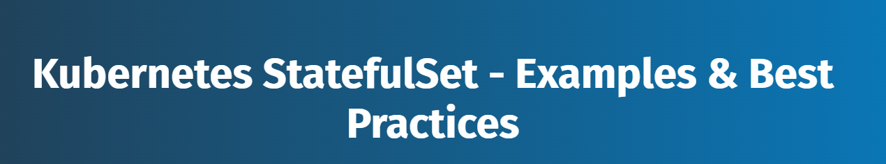
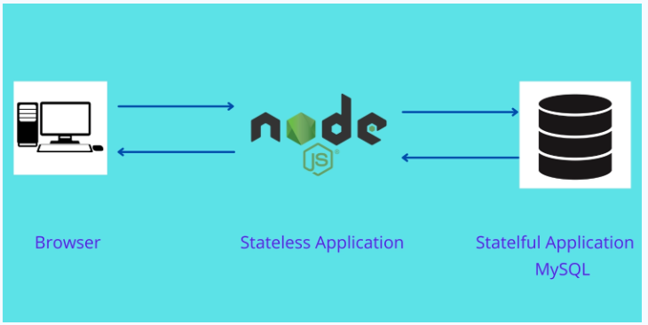
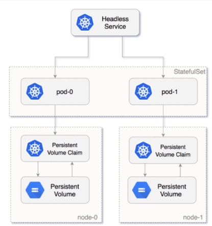
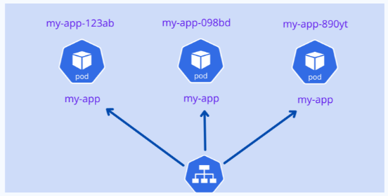
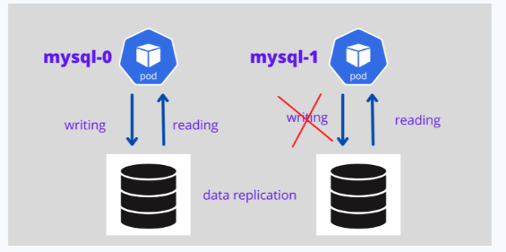
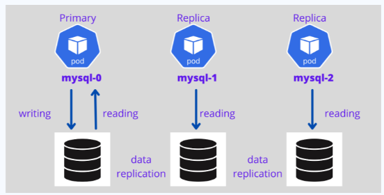
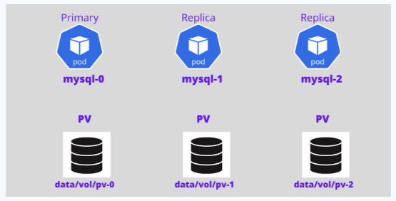
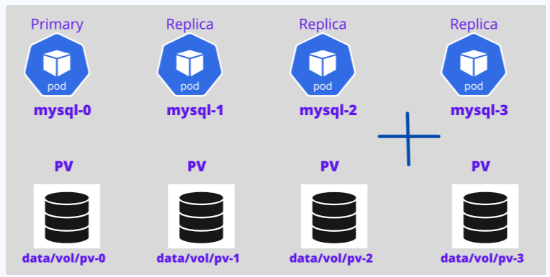
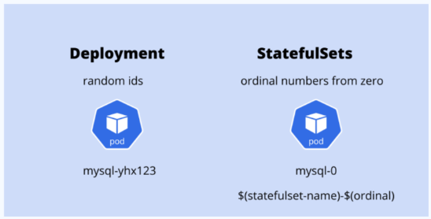
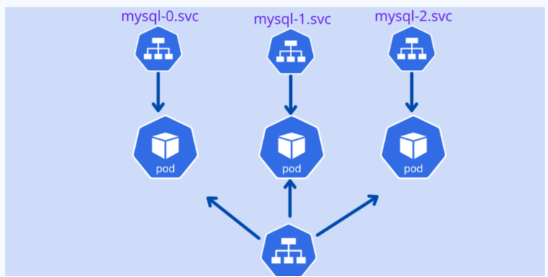

# Kubernetes StatefullSet
<p align="center">
    
</p>

<div style="text-align: justify">

## What Are Stateful Applications ?
Stateful applications receive data and store and track them. MySQL, Oracle, and PostgreSQL are some popular stateful applications.

Stateless applications are the opposite. They do not store data; they only process it when they receive it. Node.js and Nginx are examples of stateless applications.

A modern web application uses both types of applications to serve user requests. For example, Node.js, a stateless application, receives new data on each user request. It then connects to a stateful application like MySQL to process the data. MySQL then stores and updates the data based on the user's request.  

<p align="center">
    
</p>

## What Are Kubernetes StatefulSets ?
Kubernetes StatefulSets are controllers that run stateful applications as containers (Pods). They assign a sticky identity—an ordinal number starting from zero—to each Pod. They do this instead of assigning random IDs to each replica Pod.

The system creates a new Pod by cloning the previous Pod’s data. If the previous Pod remains in the pending state, then the system will not create the new Pod.

If you delete a Pod, the system will delete it in reverse order, not random order. For example, if you had four replicas and scaled down to three, it would delete the Pod numbered 3.

The diagram below shows how the Pod is numbered from zero and how Kubernetes persistent volume is attached to the Pod in the StatefulSets.

<p align="center">
    
</p>

## When to Use StatefulSets ?
There are several reasons to consider using StatefulSets. Here are two examples:

- Say you deployed a MySQL database in the Kubernetes cluster and scaled it to three replicas, and a frontend application wants to access the MySQL cluster to read and write data. The read request will be forwarded to three Pods. However, the write request will only be forwarded to the first (primary) Pod, and the data will be synced with the other Pods. You can achieve this by using StatefulSets.
- Deleting or scaling down a StatefulSet will not delete the volumes in the stateful application. This gives your data safety. If you delete the MySQL Pod or if the MySQL Pod restarts, you can have access to the data in the same volume.


## Deployment vs. StatefulSets
You can also create Pods (containers) using the Deployment object in the Kubernetes cluster. This allows you to easily replicate Pods and attach a storage volume to the Pods. The same thing can be done by using StatefulSets. What then is the advantage of using StatefulSets?

Well, the Pods created using the Deployment object are assigned random IDs. For example, you are creating a Pod named “my-app”, and you are scaling it to three replicas. The names of the Pods are created like this:

```
my-app-123ab my-app-098bd my-app-890yt
```

After the name “my-app”, random IDs are added. If the Pod restarts or you scale it down, then again, the Kubernetes Deployment object will assign different random IDs for each Pod. After restarting, the names of all Pods appear like this:

```
my-app-jk879 my-app-kl097 my-app-76hf7
```

All these Pods are associated with one load balancer service. So in a stateless application, changes in the Pod name are easily identified, and the service object easily handles the random IDs of Pods and distributes the load. This type of deployment is very suitable for stateless applications.

<p align="center">
    
</p>

However, stateful applications cannot be deployed like this. The stateful application needs a sticky identity for each Pod because replica Pods are not identical Pods.

Take a look at the MySQL database deployment. Assume you are creating Pods for the MySQL database using the Kubernetes Deployment object and scaling the Pods. If you are writing data on one MySQL Pod, do not replicate the same data on another MySQL Pod if the Pod is restarted. This is the first problem with the Kubernetes Deployment object for the stateful application.

<p align="center">
    
</p>

Stateful application Pod created with Deployment object
Stateful applications always need a sticky identity. While the Kubernetes Deployment object offers random IDs for each Pod, the Kubernetes StatefulSets controller offers an ordinal number for each Pod starting from zero, such as mysql-0, mysql-1, mysql-2, and so forth.

<p align="center">
    
</p>


For stateful applications with a StatefulSet controller, it is possible to set the first Pod as primary and other Pods as replicas—the first Pod will handle both read and write requests from the user, and other Pods always sync with the first Pod for data replication. If the Pod dies, a new Pod is created with the same name.

The diagram below shows a MySQL primary and replica architecture with persistent volume and data replication architecture.

<p align="center">
    
</p>


Now, add another Pod to that. The fourth Pod will only be created if the third Pod is up and running, and it will clone the data from the previous Pod.

<p align="center">
    
</p>

In summary, StatefulSets provide the following advantages when compared to Deployment objects:

- Ordered numbers for each Pod
- The first Pod can be a primary, which makes it a good choice when creating a replicated database setup, which handles both reading and writing
- Other Pods act as replicas
- New Pods will only be created if the previous Pod is in running state and will clone the previous Pod’s data
- Deletion of Pods occurs in reverse order

## How to Create a StatefulSet in Kubernetes
Let's go through how to create a Pod for MySQL database using StatefulSet.

### 1. Create a Secret
First, create a Secret for the MySQL app. This will store sensitive information, such as usernames and passwords.

Here, I am creating a simple Secret. However, in a production environment, using the HashiCorp Vault is recommended. Use the following code to create a Secret for MySQL:

```bash
apiVersion: v1
kind: Secret
metadata:
  name:  mysql-secret
type: Opaque
data:
   mysql-user: cm9vdA==
   mysql-pass: cGFzc3dvcmQ=
   mysql-db: d29yZHByZXNz
```

Save the code using the file name `mysql-secret.yaml`. Then, run this command on your Kubernetes cluster:

```bash
kubectl apply -f mysql-secret.yaml 
```

### 2. Create PV and PVC for Mysql

Use the following code to create a manifest file for PV and PVC to be used by MySQL:

```bash
# MySQL PV
apiVersion: v1
kind: PersistentVolume
metadata:
  name: mysql-pv
spec:
  capacity:
    storage: 10Gi
  accessModes:
    - ReadWriteOnce
  hostPath:
    path: /data/mysql
---
# MySQL PVC
apiVersion: v1
kind: PersistentVolumeClaim
metadata:
  name: mysql-pvc
spec:
  accessModes: 
    - ReadWriteOnce
  resources:
    requests:
      storage: 10Gi 
```

Save the code using the file name `mysql-pv-pvc.yaml`. Then, run this command on your Kubernetes cluster:

```bash
kubectl apply -f mysql-pv-pvc.yaml 
```

### 3. Create a MySQL StatefulSet Application

Use the following code to create a manifest file for MySQL StatefulSet. Save the code using the file name `mysql-sts.yaml`.

```bash
apiVersion: apps/v1
kind: StatefulSet
metadata:
  name: mysql-sts
spec:
  selector:
    matchLabels:
      app: mysql 
  serviceName: mysql-service
  replicas: 3
  template:
    metadata:
      labels:
        app: mysql
    spec:
      terminationGracePeriodSeconds: 10
      containers:
      - name: mysql-container
        image: mysql:5.7
        env:
          - name:  MYSQL_ROOT_PASSWORD 
            valueFrom:
              secretKeyRef:
                name:  mysql-secret
                key:  mysql-pass
        ports:
        - containerPort: 3306
        volumeMounts:
        - name: mysql-store
          mountPath: /var/lib/mysql
  volumeClaimTemplates:
  - metadata:
      name: mysql-store
    spec:
      accessModes: [ "ReadWriteOnce" ]
      storageClassName: "linode-block-storage-retain"
      resources:
        requests:
          storage: 5Gi 
```
Here are a few things to note:

- The kind is a StatefulSet. kind tells Kubernetes to create a MySQL application with the stateful feature.
- The password is taken from the Secret object using the secretKeyRef.
- The Linode block storage was used in the volumeClaimTemplates. If you are not mentioning any storage class name here, then it will take the default storage class in your cluster.
- The replication count here is 3 (using the replica parameter), so it will create three Pods named mysql-set-0, mysql-set-1, and mysql-set-2.

Then, run this command on your Kubernetes cluster:

```bash
kubectl apply -f mysql-sts.yaml 
```

### 4. Create a Service for the MySQL StatefulSet Application

Now, create the service for the MySQL Pod. Do not use the load balancer for a stateful app. Instead, create a headless service for the MySQL app using this code:

Use the following code to create a manifest file for MySQL StatefulSet. Save the code using the file name `mysql-service.yaml`.

```bash
# MySQL Service
apiVersion: v1
kind: Service
metadata:
  name: mysql-service
  labels:
    app: mysql 
spec:
  clusterIP: None
  selector:
    app: mysql
  ports:
  - port: 3306
    targetPort: 3306 
```

Then, run this command on your Kubernetes cluster:

```bash
kubectl apply -f mysql-service.yaml 
```

### 5. Create a Client for MySQL
To access MySQL, you will need a MySQL client tool. Deploy a MySQL client using the following manifest file called `mysql-client.yaml`. This Pod will be used to administrate MySQL Server.

```bash
apiVersion: v1
kind: Pod
metadata:
  name: mysql-client
spec:
  containers:
  - name: mysql-client-container
    image: alpine 
    command: ['sh','-c', "sleep 1800m"]
    imagePullPolicy: IfNotPresent 
    resources:
      limits:
        memory: "128Mi"
        cpu: "500m" 
```

Then, run this command on your Kubernetes cluster:

```bash
kubectl apply -f mysql-client.yaml 
```

Then enter this into the MySQL client:

```bash
kubectl exec --stdin --tty mysql-client -- sh 
```

Finally, install the MySQL client tool:

```bash
apk add mysql-client  
```

### 6. Access the MySQL Application Using the MySQL Client
Next, access the MySQL application using the MySQL client and create databases on the Pods.

If you are not already in the MySQL client Pod, enter it now:

```bash
kubectl exec -it mysql-client /bin/sh  
```
 
To access MySQL, you can use the same standard MySQL command to connect with the MySQL server:

```bash
mysql -u root -p -h host-server-name   
```

For access, you will need a MySQL server name. The syntax of the MySQL server in the Kubernetes cluster is given by the syntax below:

```
stateful_name-ordinal_number.mysql.default.svc.cluster.local   
```
 **Example** 
```
mysql-set-0.mysql.default.svc.cluster.local   
```

Connect with the MySQL primary Pod using the following command. When asked for a password, enter the one you made in the “Create a Secret” section above.

```bash
mysql -u root -p -h mysql-set-0.mysql.default.svc.cluster.local   
```

Next, create a database on the MySQL primary, then exit:

```bash
create database erp; exit;   
```

Now connect the other Pods and create the database like above:

```
mysql -u root -p -h mysql-set-1.mysql.default.svc.cluster.local 
mysql -u root -p -h mysql-set-2.mysql.default.svc.cluster.local    
```

**Remember that while Kubernetes helps you set up a stateful application, you will need to set up the data cloning and data sync by yourself. This cannot be done by the StatefulSets.**

## Best Practices

If you plan to deploy stateful apps, like **Oracle, MySQL, Elasticsearch, and MongoDB, use StatefulSets**. They're a great option.

You need to consider the following points while creating stateful applications:

1. Create a separate namespace for databases.
2. Place all the needed components for stateful applications, such as **ConfigMaps, Secrets, and Services**, in the particular namespace.
3. Put your custom scripts in the **ConfigMaps**.
4. Use **headless service** instead of **load balancer** service while creating Service objects.
5. Use the **HashiCorp Vault** for storing your Secrets.
6. Use the **persistent volume storage** for storing the data. Then your data won’t be deleted even if the Pod dies or crashes.

Deployment objects are the controllers most commonly used to create pods in Kubernetes. You can easily scale these Pods by mentioning the replication count in the manifest file.

For stateless applications, Deployment objects are most suitable. For example, assume you are planning to deploy your Node.js application and want to scale it to five replicas. In this case, the Deployment object is well suited.

The diagram below shows how Deployment and StatefulSets assign names to the Pods.

<p align="center">
    
</p>

StatefulSets create ordinal service endpoints for each Pod created using the replica option. The diagram below shows how the stateful Pod endpoints are created with ordinal numbering and how they communicate with each other.

<p align="center">
    
</p>


## Sources
- https://www.loft.sh/blog/kubernetes-statefulset-examples-and-best-practices?_gl=1*9ngnis*_gcl_au*MTQzNDc3MjM2NS4xNzM4NzI0Mzc0*_ga*MzU0MjA0Nzk5LjE3Mzg3MjQzNzU.*_ga_4RQQZ3WGE9*MTczODg1NDIzMS41LjEuMTczODg1NDI2Mi4yOS4wLjE3OTMzMTAyNDU.
- https://8grams.medium.com/kubernetes-101-statefulsets-f618c08f2548
- https://spacelift.io/blog/statefulset-vs-deployment
- https://www.geeksforgeeks.org/how-to-use-kubernetes-statefulsets/
- https://github.com/kubernetes/examples/blob/master/staging/volumes/vsphere/simple-statefulset.yaml
- https://kubernetes.io/docs/concepts/workloads/controllers/statefulset/


## What Next ?
Previous [Kubernetes DaemonSet](./12-Daemonset.md)

Next [Daemonset](./12-Daemonset.md)

</div>